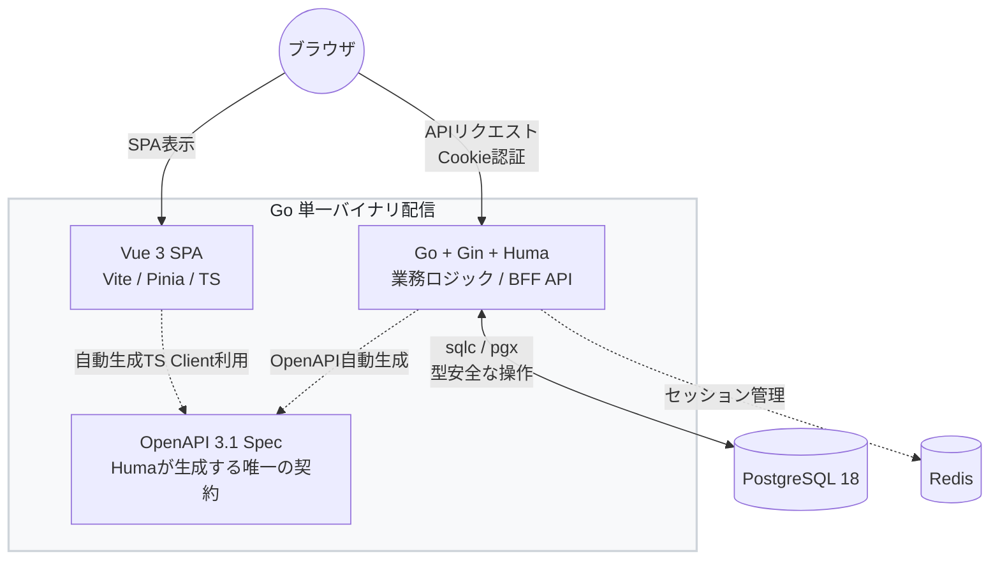
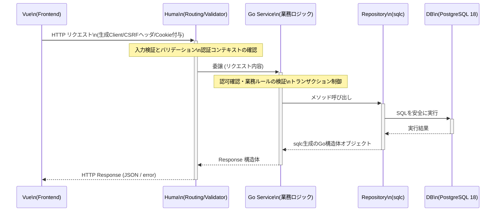
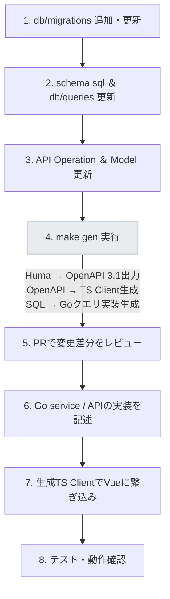
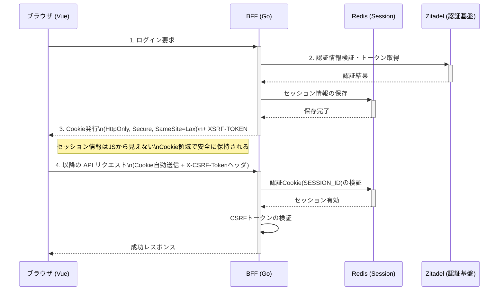

# コンセプト

## 結論

このシステムは、**OpenAPI 3.1 優先 + Monorepo + 単一バイナリ配信**を基本方針にする。

- フロントエンド: `Vue 3 + Vite + TypeScript + Pinia`
- API 契約: `Huma` で生成する `OpenAPI 3.1`
- バックエンド: `Go + Gin + Huma`
- データ層: `PostgreSQL 18 + pgx + pgxpool + sqlc`
- 認証: `BFF + HttpOnly Cookie`
- 配信: `Go バイナリに Vue の dist を埋め込んで配信`

この構成の狙いは次の 4 点。

- OpenAPI 3.1 を現実的に運用できるようにする
- 実装と API 契約のドリフトを最小化する
- SQL を主役にして PostgreSQL の機能を素直に使う
- 開発時は分離し、本番時は単純な運用に寄せる

## 基本方針

### 1. Go の型から OpenAPI 3.1 を生成する

API の定義は hand-written な YAML ではなく、Go 側の Huma operation 定義と input / output struct を正として管理する。

- 設計: Go の型とタグで API の入出力、バリデーション、説明を定義する
- 生成: Huma から OpenAPI 3.1 の spec と API docs を生成する
- 再利用: 生成した spec から TypeScript client / types を生成する
- 運用: OpenAPI 3.1 を唯一の公開契約として扱う

これにより、OpenAPI 3.1 を使いながら、仕様更新と実装更新を同じ場所で管理できる。

### 2. Monorepo

フロント、バック、生成した OpenAPI artifact、DB スキーマ、マイグレーション、CI を 1 リポジトリで管理する。

メリットは次の通り。

- 変更の追跡がしやすい
- API 変更と実装変更を同じ PR で扱える
- CI を一元管理できる
- レビュー時に影響範囲を把握しやすい

### 3. 単一バイナリ配信

本番では Vue のビルド成果物を Go 側に埋め込み、API と SPA を 1 つのバイナリで配信する。

- 開発時: `frontend` と `backend` を別プロセスで起動する
- 本番時: Go バイナリ 1 つで `/api/*`、OpenAPI、静的配信をまとめて扱う
- frontend の build 出力先は `backend/web/dist/` に揃える

これにより、運用とデプロイの複雑さを下げられる。

## アーキテクチャ

システム全体としてフロントエンドとバックエンドの疎結合を保ちつつ、運用時は単一のコンポーネントとして振る舞うように設計します。



| レイヤー       | 技術                              | 役割                                             |
| -------------- | --------------------------------- | ------------------------------------------------ |
| フロントエンド | Vue 3 + Vite + TypeScript + Pinia | UI、画面状態管理、API 呼び出し                   |
| API 契約       | Huma が生成する OpenAPI 3.1       | バックエンドとフロントエンドの共通契約           |
| バックエンド   | Go + Gin + Huma                   | 認証、認可、業務ロジック、API 提供、OpenAPI 生成 |
| データ層       | PostgreSQL 18 + `pgx` + `sqlc`    | 永続化、検索、集計、トランザクション             |
| 配信           | Go 単一バイナリ                   | API、OpenAPI、SPA の配信                         |

### 責務分離の原則

- Vue は UI と画面制御に集中する
- Huma operation は request / response、バリデーション、OpenAPI metadata に集中する
- service は業務ルールとトランザクション制御を担う
- repository は SQL 実行に集中する
- OpenAPI artifact は frontend と外部連携向けの公開契約として扱う

Huma operation に業務ロジックを書き込まない、Vue に Go の内部型を直接持ち込まない、という 2 点を強く守る。

## 推奨ディレクトリ構成

```text
my-enterprise-app/
├── docs/
├── openapi/
│   ├── openapi.yaml
├── go.work
├── frontend/
│   ├── public/
│   ├── src/
│   │   ├── api/
│   │   │   └── generated/
│   │   ├── shared/
│   │   ├── features/
│   │   └── pages/
│   ├── vite.config.ts
│   ├── openapi-ts.config.ts
│   └── package.json
├── backend/
│   ├── cmd/
│   │   ├── openapi/
│   │   │   └── main.go
│   │   └── server/
│   │       └── main.go
│   ├── internal/
│   │   ├── api/
│   │   │   ├── browser/
│   │   │   └── external/
│   │   ├── app/
│   │   ├── service/
│   │   ├── db/
│   │   ├── config/
│   │   └── middleware/
│   ├── go.mod
│   ├── sqlc.yaml
│   ├── web/
│   │   └── dist/
│   └── embed.go
├── db/
│   ├── migrations/
│   ├── queries/
│   └── schema.sql
├── compose.yaml
└── Makefile
```

### 各ディレクトリの役割

- `openapi/`: Huma から export した OpenAPI artifact
- `go.work`: repo root から `./backend` を扱うための Go workspace 定義
- `frontend/`: Vue アプリ本体
- `frontend/public/`: favicon など build に乗せる静的アセットの正本
- `frontend/src/api/`: generated client と runtime config の置き場
- `frontend/src/shared/`, `features/`, `pages/`: 初期構成の責務分離
- `backend/cmd/openapi/`: OpenAPI artifact を export する entrypoint
- `backend/cmd/server/`: backend を起動する entrypoint
- `backend/internal/api/browser/`: browser 向け BFF API
- `backend/internal/api/external/`: external client 向け API の予約領域
- `backend/internal/app/`: router, Huma, docs, static 配信の組み立て
- `backend/internal/api/`: Huma operation 登録、request / response model、OpenAPI metadata
- `backend/internal/service/`: 業務ロジック
- `backend/internal/db/`: `sqlc` 生成コード
- `backend/internal/config/`: 環境変数と設定の読み込み
- `backend/web/dist/`: frontend の build 成果物
- `db/queries/`: `sqlc` 用の SQL
- `db/migrations/`: スキーマ変更履歴。DB 変更の正本
- `db/schema.sql`: migration から再生成した現在スキーマのスナップショット。`sqlc` とレビュー用で、直接編集しない
- `compose.yaml`: 開発用の依存サービス定義。少なくとも PostgreSQL、必要なら Redis や管理 UI を含める

### Go workspace 方針

この構成では、`backend/` を独立した Go module とし、repo root に `go.work` を置く。

- `Makefile` と CI は repo root から `go run ./backend/cmd ...` を実行する前提にそろえる
- `go.work` には少なくとも `use ./backend` を含める
- もし単一 module に変えるなら、ディレクトリ構成だけでなく `Makefile`、CI、生成手順も同時に合わせて変更する

## 技術選定

### フロントエンド

`Vue 3 + Vite + TypeScript + Pinia` を採用する。

- Vue 3: 保守性と学習コストのバランスがよい
- Vite: 開発体験が軽い
- TypeScript: API 契約と接続しやすい
- Pinia: Vue 標準寄りで扱いやすい

初期構成では、frontend は `shared/`, `features/`, `pages/` のハイブリッドで構成する。

- `shared/`: 汎用 UI、共通 composable、横断 utility
- `features/`: 業務機能単位の state、API adapter、UI 断片
- `pages/`: 画面 entry と routing に近い責務

### バックエンド

`Go + Gin + Huma` を採用する。

- Go: 単一バイナリ、並行処理、運用容易性が強い
- Gin: 既存の middleware 資産を活かしやすい
- Huma: OpenAPI 3.1 生成、request validation、docs 生成を一体で扱える

既存の Gin middleware を使い続けながら、API の入出力定義と OpenAPI 生成を Huma に寄せる。

### データ層

`PostgreSQL 18 + pgx + pgxpool + sqlc` を基本とする。

- `pgx`: PostgreSQL との相性がよい
- `pgxpool`: 接続プール管理
- `sqlc`: SQL から型安全な Go コードを生成

ORM 中心ではなく、**SQL を設計資産として管理する**方針を取る。

### sqlc の運用補足

Huma 由来の OpenAPI、そこから生成する TypeScript client、さらに `sqlc` の Go 生成物まで含めると、**正本と artifact のずれがそのまま本番事故やレビュー漏れにつながる**。そのため、生成フロー全体を前提に「ずれを早く検知する」ことを運用要件に含める。

初期構成では **`sqlc Cloud` は使わない**。ローカルと GitHub Actions のみで同じチェックが再現でき、`SQLC_AUTH_TOKEN` に依存しない運用にする。

- **`sqlc generate`**: `db/schema.sql` と `db/queries/` から `backend/internal/db/` を更新する
- **`sqlc vet`**: `db/schema.sql` を載せた PostgreSQL（本 repo では 18）に対して query が成立するか検証する。CI 用には `backend/sqlc.ci.yaml` と `POSTGRESQL_SERVER_URI` で接続先を渡す
- **`sqlc verify`**: sqlc Cloud 前提のため、標準フローには入れない（`sqlc vet` と `make check-generated`、migration 変更時の `db/schema.sql` 整合チェックで代替する）

CI（`.github/workflows/generated-artifacts.yml`）では、PR 上で **`make check-generated`**、OpenAPI lint、**`db/migrations/` 変更時の `db/schema.sql` 更新漏れ検知**（`scripts/check-schema-snapshot.sh`）、PostgreSQL 18 に対する **`make sqlc-vet`** を走らせ、API 契約・SQL・schema snapshot・各生成物の更新漏れをまとめて落とす。

Issue #4 の議論のうち、external API のスモークより優先したのはこの **artifact / 契約ドリフトのガード**である。external 向け endpoint はすでに主ラインに入っている前提で、差分として価値が大きいのは OpenAPI / frontend client / sqlc の整合を機械的に守ること、という整理に寄せている。

## PostgreSQL 18 の活用方針

PostgreSQL 18 の新機能は活用するが、流行りで採用するのではなく用途を限定する。

### 設計判断として使うもの

- `UUIDv7`: 外部公開 ID や分散環境向けの主キー候補
- 仮想生成カラム: 表示補助や検索補助に限定して使う
- テンポラルコンストレイント (`WITHOUT OVERLAPS`): 予約・期間管理など重複排除が必要なテーブル設計で使う

### 使えるなら活用するが前提にはしないもの

- Async I/O: 重い読み込み系ワークロードで恩恵がある。`io_method` で `worker` / `io_uring` / `sync` を選択できる
- `pg_upgrade` 時の統計保持: 本番アップグレードの安定化に有効。`--swap`、`--jobs` オプションも追加されている
- OAuth 2.0 認証: DB レベルで外部 IdP との SSO 統合をサポートする。認証基盤を外部に寄せる場合に選択肢になる

### 特に設定不要で恩恵を受けられるもの

- ページチェックサム: PostgreSQL 18 からデフォルトで有効化されており、データ整合性の検知が標準で機能する

### ID 戦略

初期方針では、集約ごとに `bigint` と `uuidv7` を使い分ける。

- コア業務テーブルや高頻度 join / 集計が中心の内部テーブル: `bigint GENERATED ALWAYS AS IDENTITY`
- 外部公開 API の境界、外部連携対象、分散構成を意識する集約: `uuid DEFAULT uuidv7()`
- 外部に見せる必要がない巨大テーブルまで一律に `uuidv7` にはしない

## 契約生成とクライアント生成

推奨する生成フローは次の通り。

- Go + Huma → OpenAPI 3.1: custom command または export endpoint で出力する
- OpenAPI → TypeScript client: `@hey-api/openapi-ts`
- SQL → Go クエリコード: `sqlc`

TypeScript クライアント生成は `@hey-api/openapi-ts` を既定にする。

生成した client は画面から直接ばらばらに呼ばず、`frontend/src/api/` 配下の transport wrapper 経由で使う。

- `baseURL` は同一オリジン前提で `/api` に寄せる
- `credentials: "include"` を既定にする
- `POST`, `PUT`, `PATCH`, `DELETE` では `XSRF-TOKEN` Cookie を読んで `X-CSRF-Token` を自動付与する
- problem details を UI 向けのエラー表現に寄せる場所を 1 か所にする

OpenAPI artifact は repo に含め、PR で差分レビューできるようにする。加えて、本番の docs / OpenAPI endpoint は認証付きで公開し、固定版の補助配布経路として GitHub Release / release asset も持つ。

OpenAPI 3.0.3 へのダウングレード出力は初期構成では持たず、OpenAPI 3.1 を唯一の公開契約とする。

Makefile には少なくとも `gen` を用意する。

```make
gen:
	go run ./backend/cmd openapi > openapi/openapi.yaml
	npx @hey-api/openapi-ts -i openapi/openapi.yaml -o frontend/src/api/
	sqlc -f backend/sqlc.yaml generate
```

Huma の spec export は、サーバー起動中の `/openapi.yaml` を取得する形でもよいが、CI では起動不要な custom command を持つほうが扱いやすい。

## OpenAPI ドキュメント表示

OpenAPI artifact は YAML / JSON を配るだけで終わらせず、ブラウザで閲覧できる対話型ドキュメントを同時に提供する。Huma の Generated API Docs や Elysia の OpenAPI plugin のように、1 つの OpenAPI spec をソースにして docs UI を描画し、docs と raw spec の内容を分離しない。

- Huma の built-in docs route は `/docs` で提供する
- renderer を切り替え可能な OpenAPI Documents は `/openapi` で提供する
- 機械向けの raw spec は `/openapi.json` と `/openapi.yaml` で提供する
- `/openapi` で使える renderer は `Stoplight Elements`, `Scalar`, `Swagger UI` とする
- 初期構成では `Stoplight Elements` を既定にし、`Scalar` と `Swagger UI` は用途に応じて切り替えられるようにする
- `/openapi` を無効化して raw spec のみ公開するモードも持つ

初期構成では、Huma の built-in docs route を `/docs` に残しつつ、認証付きの主導線は別に `/openapi` として持つ方針にする。

- docs への認証、CSP、ヘッダー制御をアプリ側で一元化しやすい
- `Stoplight Elements`, `Scalar`, `Swagger UI` の切り替えや self-hosted asset への差し替えを行いやすい
- Go 単一バイナリ配信でも docs UI と spec 配信を同じ router で完結できる
- `/docs` を fallback / 比較用として残しながら `/openapi` を主導線として育てられる

docs 画面には最低限次を含める。

- API title / version
- 認証方式の説明
- operation 一覧と request / response schema
- raw spec へのリンク (`/openapi.json`, `/openapi.yaml`)
- built-in docs へのリンク (`/docs`)

対話実行については、Cookie 認証 + CSRF を崩さないことを優先する。

- `GET` / `HEAD` の確認は docs UI からそのまま実行できるようにする
- `POST`, `PUT`, `PATCH`, `DELETE` を docs UI から叩く場合は、`XSRF-TOKEN` Cookie を `X-CSRF-Token` に写す導線を custom JS か renderer 拡張で補う
- その導線を整える前の初期構成では、state-changing operation の対話実行は無効でもよい

開発環境ではローカルからそのまま参照できるようにし、本番環境では docs / spec の両方を認証付きで公開する。

## API バージョニング

既定の方針は URL path versioning とし、`/api/v1` を使う。

- Huma の operation 定義と router 設定で扱いやすく、OpenAPI artifact と生成 client にも素直に反映される
- 互換性を壊す変更は `/api/v2` のように新しい path prefix を切る
- 後方互換な追加変更は同一バージョン内で進める
- header や media type によるバージョニングは、既存 API gateway 制約などの特殊要件がある場合だけ検討する

## リクエスト処理の流れ



### Vue

- transport wrapper 経由で生成 client を呼ぶ
- state-changing request では CSRF ヘッダーを自動付与する
- DTO を画面表示用に薄く整形する
- 表示する

### Huma operation

- path / query / header / body を受ける
- Huma が入力変換とバリデーションを行う
- 認証済みコンテキストを確認する
- service に委譲する
- response struct を返す

### Go service

- 認可確認
- 業務バリデーション
- repository 呼び出し
- トランザクション制御

### Repository / sqlc

- SQL 実行
- 結果を Go 型として返す

## 開発フロー



1. `db/migrations/` を追加または更新する
2. migration を適用した DB から `db/schema.sql` を再生成し、`db/queries/` を更新する
3. `backend/internal/api/` の operation と input / output model を更新する
4. `make gen` を実行する
5. export された OpenAPI artifact を PR 上で frontend と一緒にレビューする
6. `service` と API 実装を進める
7. フロントで transport wrapper 経由の生成済み client を使って接続する
8. テストとローカル動作確認を行う

この順番にすると、実装・OpenAPI artifact・frontend client がずれにくい。

## 開発環境と本番環境

### 開発環境

開発時はフロントとバックを分ける。

- `cd frontend && npm run dev`
- `cd backend && go run ./cmd`
- `vite.config.ts` の proxy で `/api` を Go に流す
- Huma の docs と spec は `/docs`、`/openapi`、`/openapi.json`、`/openapi.yaml` で確認する

これにより、HMR を維持しつつ CORS 設定を単純化できる。

開発環境は、foundation 段階と auth 実装段階で分けて考える。

- Foundation 段階: PostgreSQL、Redis、backend、frontend だけで起動できる状態を標準にする
- Auth 実装段階: 上記に加えて Zitadel を接続し、stub の login / session / docs auth を本実装へ置き換える
- つまり、Zitadel は repo 初期化直後の必須依存にはしない。`v0.2 Auth` に入る前に導入する
- auth 実装前の作業が多いので、`make compose-up` だけで詰まらない構成を維持する

標準のローカル起動順は次の通り。

1. `make compose-up` で PostgreSQL と Redis を起動する
2. `make gen` で OpenAPI / client / sqlc を再生成する
3. `make backend` で backend を起動する
4. `make frontend` で frontend を起動する

auth 実装フェーズに入ったら、これに Zitadel の起動または接続設定を追加する。

- local で閉じるなら、Zitadel は compose profile または auth 用の compose 定義で opt-in 起動にする
- 共有 dev 環境を使うなら、local compose に無理に含めず、issuer URL と client 情報だけを切り替える
- どちらを選ぶ場合でも、issuer URL、project、application、redirect URI、logout URI、初期ユーザー / role の投入手順を文書化する
- foundation 段階の contributor に auth 基盤の常時起動を要求しない

`compose.yaml` では、少なくとも次を起動できるようにする。

- PostgreSQL 18
- Redis: 初期推奨構成では含める。署名付き Cookie のみで始める場合は省略可
- 管理 UI: 必要なら PGAdmin など

auth 実装フェーズでは、追加で次を満たす。

- Zitadel への接続先が local か共有 dev かを明示する
- backend の env var で issuer URL と OIDC client 情報を渡せるようにする
- login callback と logout callback の URL を frontend / backend のローカル URL に合わせて登録する
- docs / OpenAPI 閲覧権限に使う role / scope の seed 方法を決める

### 本番環境

本番では Vue の build 成果物を `backend/web/dist/` に出力し、Go に埋め込む。

1. `frontend` を build し、出力先を `backend/web/dist/` に揃える
2. `backend/embed.go` で `//go:embed` により成果物を埋め込む
3. `/api/*` は API に渡す
4. OpenAPI と docs は認証付きで公開する
5. 静的ファイルが存在する場合はそのまま返す
6. それ以外の `GET` / `HEAD` で HTML を要求するリクエストだけ `index.html` を返す
7. 存在しないアセットは 404 にする

```go
package main

import "embed"

// backend/embed.go に置く例
//go:embed web/dist/*
var frontend embed.FS
```

Docker では多段階ビルドを採用し、Node で frontend を build した後に Go バイナリを作る。

静的アセット配信の負荷が将来ボトルネックになった場合は、`backend/web/dist/` の成果物を CDN や object storage に逃がし、Go を API 専用サーバーとして分離できるようにしておく。

## 設定管理

環境差分と秘密情報は `backend/internal/config/` に集約する。

- DB 接続先
- Cookie の `Secure`、`SameSite`、domain 設定
- CORS の許可 Origin
- 外部認証基盤の接続情報
- Huma の docs / OpenAPI endpoint の公開設定
- docs renderer (`stoplight-elements` / `scalar` / `swagger-ui` / `none`) と asset 配信方法
- 各種 secret と feature flag

設定の読み込み元は環境変数を基本とし、起動時にバリデーションして不足を早期に検知する。

## 時刻の扱い

日時の扱いは最初に統一ルールを決めておく。

- DB では `timestamptz` を使い、UTC で保存する
- Go 内部の `time.Time` も UTC 基準で比較・計算する
- API では RFC 3339 形式でやり取りする
- JST など利用者向けのタイムゾーン変換と表示整形は frontend で行う
- 日付のみを扱う項目は、時刻付き値に安易に寄せず `date` 相当として別扱いする

## 認証・セキュリティ

### 認証方針

認証は **BFF + HttpOnly Cookie** を基本とする。

- ブラウザに秘密情報を持たせない
- `localStorage` に JWT を置かない
- `HttpOnly`, `Secure`, `SameSite` 属性付き Cookie を使う

### 推奨フロー



1. Vue からログイン要求を送る
2. Go が認証基盤または自前の認証処理で本人確認する
3. セッション ID を Cookie に設定する
4. 以後の API リクエストでは Cookie を検証する

この「認証基盤」は、初期構成では Zitadel を指す。
実装方式は、BFF が OIDC Relying Party になり、ブラウザは BFF 経由で Zitadel Hosted Login に遷移する形を基本とする。

- browser は `GET /auth/login` のような backend endpoint を叩き、BFF が Zitadel の authorize endpoint へ redirect する
- callback は backend が受け、authorization code を token に交換する
- backend は Zitadel の `sub` を自前の user record と対応付け、必要な最小情報だけを Redis session に保存する
- access token / refresh token は browser の JavaScript に渡さず、必要なら backend 側で保持または破棄する
- frontend は「Zitadel と直接会話する SPA」ではなく、「BFF が発行した session を使う SPA」として扱う

この形にしておくと、browser 向け Cookie session と external client 向け bearer token を同じ認証基盤の上で分離しやすい。

### CSRF 方針

CSRF 防御は `SameSite=Lax` に加えて、cookie-to-header 方式の CSRF トークンを既定にする。

- セッション Cookie は `SESSION_ID` として `HttpOnly`, `Secure`, `SameSite=Lax` で保持する
- BFF は別途 `XSRF-TOKEN` Cookie を発行する。この Cookie は JavaScript から読めるが、認証情報は入れない
- Vue は `POST`, `PUT`, `PATCH`, `DELETE` のたびに `XSRF-TOKEN` を読み、`X-CSRF-Token` ヘッダーとして送る
- Go は state-changing request で `X-CSRF-Token` を必須とし、Cookie 内の値と照合する
- `GET`, `HEAD`, `OPTIONS` は CSRF トークン検証の対象外にする

### CSRF トークンの発行と更新

- `XSRF-TOKEN` はログイン成功時とセッション再発行時に払い出す
- SPA 初回ロード時にトークンが未取得なら、`/api/session` や `/api/csrf` のような bootstrap endpoint で取得する
- トークンは every request ではローテーションしない。ログイン、ログアウト、セッション更新、権限変更のタイミングで更新する
- frontend は token refresh を個別画面で処理せず、transport wrapper で吸収する

### frontend との接続ルール

生成 client と Cookie 認証を確実に両立させるため、ブラウザからの API 呼び出しは 1 つの transport wrapper に集約する。

- `credentials: "include"` を必須にする
- `XSRF-TOKEN` Cookie の読み出しと `X-CSRF-Token` ヘッダー付与を wrapper で共通化する
- 認証切れ、CSRF エラー、problem details の変換を wrapper で吸収する

### ブラウザ以外の client

この Cookie + CSRF 方式は、同一オリジンのブラウザ SPA 向けの既定方針とする。

- external client や cross-origin API が必要になった場合は、Cookie セッションとは別に bearer token や OAuth2 などの認証方式を別 API surface として設計する
- OpenAPI の security scheme も browser 向けと external client 向けで分ける
- どちらも同時に必要なら、運用ルールと rate limit を分離する

### セッションストア

セッションの保存先は、運用要件に応じて決める。

- Redis: TTL 管理がしやすく、BFF のセッションストアとして扱いやすい
- PostgreSQL: 依存を増やしたくない場合の候補
- 署名付き Cookie のみ: 状態を極力持たない構成にしたい場合の候補

初期推奨構成では、サーバー側セッション + Redis を採用する。

- TTL 管理、セッション失効、複数インスタンス運用を単純にしやすい
- 署名付き Cookie のみで始めるのは、権限制御や失効要件がかなり軽い場合に限る

### 認証基盤の候補

大規模システムでは、認証の実装を自前で抱え込みすぎない。

- SaaS: Auth0、AWS Cognito、Firebase Auth
- OSS / self-hosted: Keycloak、Zitadel
- 自前実装: 要件が強く特殊な場合だけ検討する

初期構成では、OSS / self-hosted の Zitadel を採用する。

- 認証基盤の制御性を確保しやすい
- browser 向け Cookie セッションと external client 向け token 発行を整理しやすい
- 代わりに、可用性、アップグレード、監視、バックアップは自前で運用する前提になる

### Zitadel の導入タイミング

Zitadel は「最初から常駐させる基盤」ではなく、「auth フェーズに入る時点で導入する基盤」として扱う。

- M1 / `v0.1 Foundation`: stub auth のまま、API surface、OpenAPI、DB、生成導線、frontend 接続を固める
- M2 / `v0.2 Auth`: Zitadel を接続し、login / logout / callback / session refresh / docs auth を本実装へ置き換える
- M3 以降: role / scope、docs 閲覧権限、external client 向け token 発行などを段階的に広げる

この順番にする理由は次の通り。

- foundation の作業は Zitadel がなくても進められる
- auth の前に browser API と external API の境界を固定した方が手戻りが少ない
- local 開発環境の複雑化を auth 実装に必要な時点まで遅らせられる

### 開発環境での Zitadel 導入方法

開発環境では、local self-hosted を第一候補とするが、常時必須にはしない。

- 第一候補: auth 用 compose profile か別 compose file で Zitadel を追加し、ローカルで閉じて再現できるようにする
- 第二候補: 共有 dev の Zitadel tenant を使い、local backend / frontend から接続する
- どちらを選んでも、backend は issuer URL と OIDC client 設定を env var から読む

最低限そろえる項目は次の通り。

- issuer URL
- browser 用 OIDC application の client ID / secret
- redirect URI
- post-logout redirect URI
- docs 閲覧権限や app role に使う role / scope
- 初期ユーザーまたは test user の投入手順

backend の設定としては、少なくとも次を受けられるようにする。

- `ZITADEL_ISSUER_URL`
- browser login 用 client ID / secret
- callback URL と logout callback URL
- 必要なら audience, organization / project ID, docs 権限判定に使う claim 名

これらの設定は `backend/internal/config/` に集約し、起動時に不足を検知する。

### エラーハンドリング

API エラーは Huma の標準エラー形式をベースに統一する。

- バリデーションエラーは Huma の入力検証で返す
- 業務エラーは service で分類し、operation で適切な HTTP エラーに変換する
- frontend は HTTP ステータスと problem details の内容でハンドリングする

Go 側の実装では、業務エラーを機械可読な code を持つ domain error として表現する。

- service は `code`、利用者向け message、内部 cause を持つ domain error を返す
- operation は `code` を見て HTTP status と problem details に変換する
- frontend は文言ではなく `code` を基準に分岐する
- 業務判定のために ad-hoc な文字列比較や散在した sentinel error を増やさない

必要であれば、Huma のデフォルト error model を organization 向けに差し替える。

### ログ

ログは Go の構造化ログを前提に統一する。

- operation / middleware: リクエスト ID、メソッド、パス、ステータス、レイテンシ
- service: 業務イベントとエラー
- 開発時は読みやすさ、本番は集約しやすさを優先する

### 監視・オブザーバビリティ

初期段階では最小構成でよいが、後から追加しやすい形にしておく。

- Go: `pprof` とアプリケーションメトリクスの導線を持つ
- メトリクス: Prometheus などで収集できる形にする
- トレース: 必要になった段階で OpenTelemetry を追加できるようにする
- DB: `EXPLAIN ANALYZE` と PostgreSQL の標準統計で重いクエリを追えるようにする

### セキュリティ対策

| 項目          | 方針                                                                                                              |
| ------------- | ----------------------------------------------------------------------------------------------------------------- |
| XSS           | `v-html` を原則禁止し、CSP を設定する                                                                             |
| CSRF          | `SameSite=Lax` + cookie-to-header の CSRF トークンを使い、state-changing request では `X-CSRF-Token` を必須にする |
| CORS          | 許可 Origin を明示し、`*` を使わない                                                                              |
| SQL Injection | `sqlc` とパラメータ化クエリで防ぐ                                                                                 |
| 入力検証      | Huma と Go 側の両方で検証する                                                                                     |
| 権限制御      | operation ではなく service で最終判断する                                                                         |

### Huma でのセキュリティ定義例

Cookie 認証スキームは Huma の config / operation で登録し、その結果が OpenAPI に反映される。

```go
config := huma.DefaultConfig("My API", "1.0.0")
config.Components.SecuritySchemes = map[string]*huma.SecurityScheme{
	"cookieAuth": {
		Type: "apiKey",
		In:   "cookie",
		Name: "SESSION_ID",
	},
}

huma.Register(api, huma.Operation{
	OperationID: "get-session",
	Method:      http.MethodGet,
	Path:        "/api/session",
	Security: []map[string][]string{
		{"cookieAuth": {}},
	},
}, handler)
```

生成される OpenAPI artifact では、次のような YAML になる。

```yaml
components:
  securitySchemes:
    cookieAuth:
      type: apiKey
      in: cookie
      name: SESSION_ID
security:
  - cookieAuth: []
```

### DB 側の防御

- Row-Level Security を必要な箇所で使う
- 機微データは暗号化を検討する
- DB 接続ユーザーは最小権限にする

## マイグレーション戦略

初期段階では `golang-migrate` のような versioned SQL ベースで十分。

- 最初は単純な運用を優先する
- スキーマ差分管理や drift 検知が必要になったら `Atlas` を検討する
- `db/migrations/` を正本とし、`db/schema.sql` は migration 適用後の DB から再生成する
- `sqlc` は再生成された `db/schema.sql` と `db/queries/` を入力にする
- CI では migration からスキーマを再構築し、`db/schema.sql` の更新漏れを検知する

重要なのは、アプリケーションコードより前にスキーマ変更手順を整備すること。

## ページネーション方針

ページネーションは一律ではなく、用途ごとに `cursor` と `offset` を使い分ける。

- external client 向け API や更新頻度の高い一覧は `cursor` を使う
- 管理画面や総件数表示、任意ページジャンプが必要な画面は `offset` を使う
- 同じ資源でも browser 向け画面と external client 向け API で方式が異なることは許容する

## テスト戦略

最低限、次の 5 層を用意する。

- 契約テスト: OpenAPI 3.1 の export と lint
- 生成物テスト: OpenAPI artifact と frontend client の差分検知
- データ層テスト: migration を適用した実 PostgreSQL に対して `sqlc` のクエリを検証する
- アプリケーションテスト: Go test と frontend の typecheck / build
- 結合 / E2E テスト: ログイン、Cookie 認証、CSRF、防御付き API、SPA fallback、埋め込み配信の smoke test

データ層テストでは、ローカルと CI の両方で再現しやすいように `testcontainers-go` などで PostgreSQL コンテナを起動する方針が扱いやすい。

ブラウザ導線の確認には、少なくとも 1 本は Playwright などでログインから画面表示までの smoke test を持つ。

## CI で最低限やること

- OpenAPI 3.1 の export
- OpenAPI artifact の lint / validate
- 生成 client の更新漏れチェック
- migration 実行確認
- `sqlc -f backend/sqlc.yaml generate`
- `sqlc -f backend/sqlc.yaml vet`
- `golangci-lint`
- Go test
- Frontend lint / format check: `Biome`
- Frontend typecheck / build
- Cookie 認証と CSRF の smoke test
- 埋め込み済み SPA のルーティング smoke test

この文書では、生成した OpenAPI artifact と frontend client をコミット対象とする。したがって、**CI で差分検知する**ことは必須。

初期構成の CI は sqlc Cloud には依存しない。したがって、`sqlc verify` は最低限の必須項目には含めず、`make gen` による生成物差分検知、`db/schema.sql` の更新漏れ検知、schema を流し込んだ PostgreSQL に対する `sqlc vet` を優先する。

## GitHub プロジェクト運用方針

設計・実装・運用を同じ単位で追跡するため、GitHub の管理面も明示的に定義する。

- 実装タスクは Issue 化し、`TODO.md` のテンプレートに沿って起票する
- 実装フェーズは milestone `M1`-`M5` で管理する
- リリース進行は milestone `v0.1 Foundation`, `v0.2 Auth`, `v0.3 First Feature` を使う
- 横断管理は GitHub Project で行い、`Priority`, `Area`, `Risk`, `Target Release` を必須フィールドとして扱う
- ラベルは `priority:*`, `area:*`, `track:phase-*` を基本セットとする
- PR はテンプレートベースでレビュー観点（契約差分、`make gen`、DB 変更、テスト）を固定する
- レビュー責務は `CODEOWNERS` で明示し、`main` は branch protection で保護する

この運用により、コード差分だけでなく「どのフェーズの、どの領域を、どのリスクで進めているか」を常に可視化できる。

## この構成の利点

- OpenAPI 3.1 を現実的に運用しやすい
- API 実装と公開契約のドリフトを小さくできる
- 型不整合による手戻りが減る
- SQL を隠蔽しすぎず、DB の性能を活かせる
- 単一バイナリ配信で運用が単純になる

## まず決めるべきこと

実装に入る前に、最低でも次は決めておく。

- OpenAPI artifact をリポジトリに含めるか
- OpenAPI 3.1 を唯一の公開契約として扱うか
- docs / OpenAPI endpoint を本番で公開するか
- OpenAPI artifact の固定版をどこで配布するか
- ID 戦略を `bigint` と `uuidv7` のどちらにするか
- 認証基盤を外部サービスに寄せるか自前にするか
- external client 向け API を別認証方式で持つか
- API バージョニング戦略をどうするか
- ページネーション方式を cursor / offset のどちらにするか
- フロントを feature-based に分割する粒度

この文書では次を採用する。

- OpenAPI artifact はリポジトリに含める
- OpenAPI 3.1 を唯一の公開契約とする
- docs / OpenAPI endpoint は認証付きで公開する
- GitHub Release / release asset を固定版の補助配布経路として使う
- ID 戦略は集約ごとに `bigint` と `uuidv7` を使い分ける
- 認証基盤は OSS / self-hosted の Zitadel を採用する
- external client 向け API は browser 向けとは別 API とし、bearer token を使う
- API バージョニングは URL prefix の `/api/v1` を使う
- ページネーションは `cursor` / `offset` を使い分ける
- frontend は `shared/`, `features/`, `pages/` のハイブリッド構成にする

## 推奨する初期構成

迷う場合は、まず次で始める。

- API 契約: Huma で生成する OpenAPI 3.1
- バックエンド: Go + Gin + Huma
- フロント client 生成: `@hey-api/openapi-ts`
- OpenAPI 配布: repo commit + 認証付き docs + GitHub Release asset
- OpenAPI docs UI: `/docs` (built-in) + `/openapi` (`Stoplight Elements` / `Scalar` / `Swagger UI`) + `/openapi.json` + `/openapi.yaml`
- DB: PostgreSQL 18 + `pgx` + `sqlc`
- ID 戦略: 集約ごとに `bigint` と `uuidv7` を使い分ける
- 認証: BFF + HttpOnly Cookie
- 認証基盤: Zitadel
- セッションストア: Redis
- マイグレーション: `golang-migrate`
- external client 向け API: browser 向けと分離し bearer token を使う
- API バージョニング: `/api/v1`
- ページネーション: `cursor` / `offset` を使い分ける
- frontend 構成: `shared/` + `features/` + `pages/`
- 配信: Vue build を Go に埋め込む

この構成なら、OpenAPI 3.1・開発速度・保守性・運用性のバランスがよい。

## 参照した公式情報:
- Huma OpenAPI generation: https://huma.rocks/features/openapi-generation/
- Huma Generated API Docs: https://huma.rocks/features/api-docs/
- Huma router adapter / `humagin`: https://huma.rocks/features/bring-your-own-router/
- Huma validation: https://huma.rocks/features/request-validation/
- Huma errors / RFC 9457: https://huma.rocks/features/response-errors/
- Huma CLI / spec export: https://huma.rocks/features/cli/
- Elysia OpenAPI plugin: https://elysiajs.com/plugins/openapi
- `oapi-codegen` の 3.1 未対応: https://github.com/oapi-codegen/oapi-codegen
- `@hey-api/openapi-ts` の 3.1 対応: https://github.com/hey-api/openapi-ts / https://www.npmjs.com/package/%40hey-api/openapi-ts
