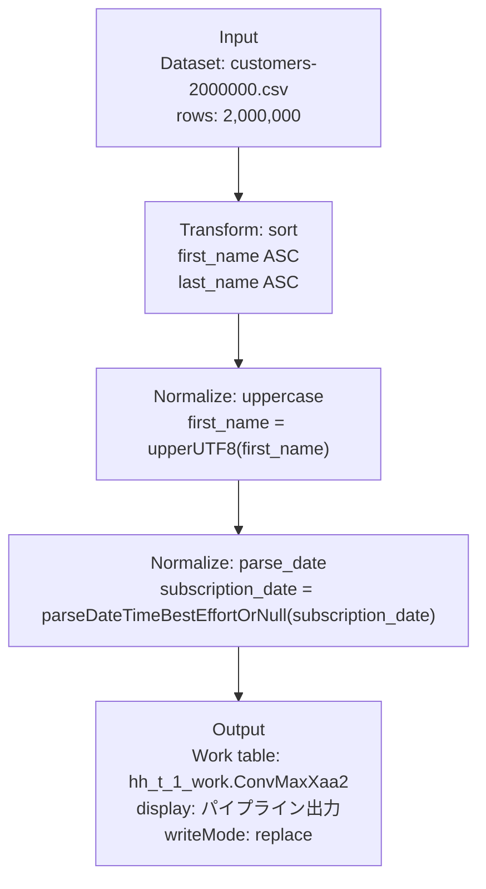
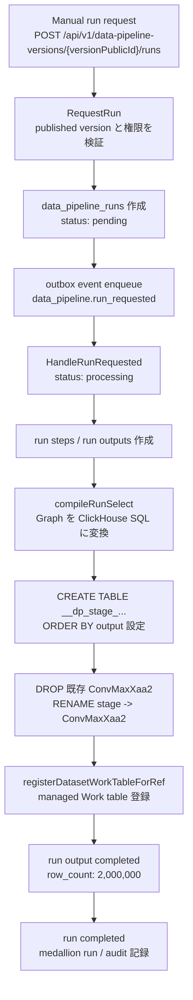

# Data Pipeline Current State

## 概要

この文書は、現在の HaoHao Data Pipeline 実装をコードから調査したメモです。設計計画は `docs/data-pipeline.md`、非構造化プレビューの詳細は `docs/data-pipeline-draft-run-preview.md` にあり、この文書では「今どこまで実装されているか」と「主要な処理経路」を中心に整理します。

Data Pipeline は、tenant ごとの Dataset / Work table / Drive file を入力にし、DAG 形式の graph を version 管理して、preview、manual run、schedule run を行う機能です。構造化データだけの graph は ClickHouse SQL に compile して実行し、Drive OCR や JSON / Excel extract などを含む graph は ClickHouse 上の中間テーブルへ materialize しながら実行する hybrid path に分岐します。

2026-05-16 までの一連の実装セッションで追加した runtime node、SCD2 merge、Gold publish 導線、検証コマンドの短い引き継ぎは `docs/DATA_PIPELINE_SESSION_HANDOFF.md` にまとめています。

## この文書の読み方

この文書は、Data Pipeline の実装を初めて読む人が「画面で作った pipeline が backend でどう実行されるか」を追えるようにするための現状メモです。細かい設計判断は関連ドキュメントに譲り、ここでは現在のコードで確認できる用語、処理経路、注意点を中心に説明します。

まず押さえる用語は次の通りです。

- Pipeline: データ処理のまとまり。画面上で作る「レシピ」全体。
- Version: pipeline graph の保存版。run / schedule は published version を対象にする。
- Graph: node と edge で表した処理手順。Vue Flow の JSON として保存される。
- Node: input、normalize、output などの処理ステップ。
- Edge: node 同士の接続。前段 node の結果を後段 node が読む、という依存関係を表す。
- Preview: pipeline 全体を永続実行せず、選択 node までの途中結果を見る操作。
- Run: published version を実行し、結果を Work table として保存する操作。
- Schedule: daily / weekly / monthly の時刻に run を作る設定。
- Work table: ClickHouse 上に作られる tenant 管理の出力テーブル。既存の Dataset / Work table UI から参照できる。
- Materialize: node の途中結果を ClickHouse の実テーブルとして一時的に作ること。
- Hybrid path: SQL compile だけでは処理できない Drive OCR や extract 系 node を、中間テーブルを作りながら実行する経路。
- SCD2 snapshot table: `snapshot_scd2` node や output `writeMode=scd2_merge` で作られる履歴管理 table。`valid_from`、`valid_to`、`is_current`、`change_hash` を持ち、entity の current row と history row を同じ table に保持する。

## 全体像

Data Pipeline は 1 つのファイルや 1 つの API だけで完結していません。大きく見ると、次の順に責務が分かれています。

```text
Frontend
  -> pipeline graph を作る / 保存する / preview や run を要求する
Backend API
  -> tenant、role、resource action、CSRF、idempotency を確認する
Service
  -> graph validation、version 管理、preview / run / schedule の業務処理を行う
PostgreSQL
  -> pipeline metadata、version、run、step、output、schedule を保存する
Outbox / Scheduler
  -> manual run や scheduled run を非同期実行へ渡す
ClickHouse
  -> Dataset / Work table を読み、SQL または中間テーブルで処理する
Dataset service / Medallion
  -> output を Work table として登録し、lineage / audit を記録する
```

初心者向けに一言で言うと、Frontend が「処理の地図」を作り、Backend がその地図を検査し、ClickHouse が実際のデータを処理します。PostgreSQL は地図や実行履歴を保存し、ClickHouse は大量データの読み書きを担当します。

Outbox は HaoHao だけの独自概念ではなく、一般的な `Transactional Outbox` パターンです。DB transaction の中で「あとで実行してほしい処理」を `outbox_events` に保存し、別の worker がその event を拾って実行します。HaoHao 固有なのは、`data_pipeline.run_requested` や `drive.ocr.requested` のような event type と、それを処理する handler の中身です。

## 主要ファイル

- `backend/internal/service/data_pipeline_service.go`: pipeline / version / run / schedule / schema mapping の service 層。
- `backend/internal/service/data_pipeline_graph.go`: graph contract、step catalog、validation、topological order。
- `backend/internal/service/data_pipeline_compile.go`: 構造化 graph の ClickHouse SQL compiler と通常 run executor。
- `backend/internal/service/data_pipeline_unstructured.go`: Drive file / OCR / 非構造化 node を含む hybrid executor。
- `backend/internal/service/data_pipeline_json.go`: JSON input / JSON extract materialize。
- `backend/internal/service/data_pipeline_spreadsheet.go`: Drive spreadsheet / Excel extract materialize。
- `backend/internal/api/data_pipelines.go`: user 向け Data Pipeline API。
- `backend/internal/api/tenant_admin_data_pipelines.go`: tenant admin 向け schema mapping 管理 API。
- `backend/internal/jobs/data_pipeline_scheduler.go`: due schedule を claim して run を作る background job。
- `db/migrations/0040_data_pipelines.up.sql`: pipeline 本体、version、run、run step、schedule の schema。
- `db/migrations/0041_data_pipeline_run_outputs.up.sql`: 複数 output node 用の run output schema。
- `db/queries/data_pipelines.sql`: sqlc query 定義。
- `frontend/src/api/data-pipelines.ts`: frontend API client と graph 型。
- `frontend/src/stores/data-pipelines.ts`: Pinia store、draft graph、preview cache、run / schedule 操作。
- `frontend/src/views/DataPipelinesView.vue`: pipeline list / builder 画面。
- `frontend/src/views/DataPipelineDetailView.vue`: pipeline detail 画面。
- `frontend/src/components/DataPipelineFlowBuilder.vue`: Vue Flow builder。
- `frontend/src/components/DataPipelineInspector.vue`: node 設定 inspector。
- `frontend/src/components/DataPipelinePreviewPanel.vue`: preview 表示。
- `frontend/src/components/DataPipelineNode.vue`: graph node 表示。
- `frontend/src/components/DatasetWorkTableBrowser.vue`: Work table 一覧、列一覧、preview、export、Gold publish。SCD2 snapshot table の preview 内 current/history 集計と filter もここで表示する。

## データモデル

PostgreSQL 側の主な table は次の通りです。

- `data_pipelines`: pipeline の名前、説明、状態、published version を保持する。
- `data_pipeline_versions`: graph JSON、version number、publish 状態、validation summary を保持する。
- `data_pipeline_runs`: manual / scheduled run の状態、代表 output work table、row count、error を保持する。
- `data_pipeline_run_steps`: node 単位の status、row count、error sample、metadata を保持する。
- `data_pipeline_run_outputs`: output node 単位の status、output work table、row count、metadata を保持する。
- `data_pipeline_schedules`: daily / weekly / monthly schedule、次回実行時刻、last run 状態を保持する。

`0040_data_pipelines.up.sql` では `data_pipeline_user` role も追加され、`medallion_pipeline_runs.pipeline_type` に `data_pipeline` が追加されています。`0041_data_pipeline_run_outputs.up.sql` により、1 run に複数 output node を持つ構造へ拡張されています。

初心者向けに見ると、PostgreSQL の table は「実データ」ではなく「管理情報」を持ちます。例えば `data_pipeline_runs` は run が pending か completed か、どの version を実行したか、代表 output が何かを持ちます。一方、処理対象の行データや出力行は ClickHouse の tenant database にあります。

### metadata の保存先の使い分け

Data Pipeline で「metadata に保存する」と言う場合、何のための情報かによって保存先を分けます。品質 summary や warning をすべて行データに埋め込むと後から run 一覧や step detail で見づらくなり、逆に行ごとの判定を PostgreSQL の summary にだけ置くと後続 node が使えません。

- `data_pipeline_run_steps.metadata`: node 単位の実行結果 metadata の主な保存先です。`quality_report` の欠損率 summary、`confidence_gate` の threshold 超過件数、`schema_inference` の型推定 summary、`extract_table` の抽出 warning、`join` / `enrich_join` の未マッチ件数や行数増減など、run detail や UI 表示で見たい集計情報を置きます。
- `data_pipeline_run_outputs.metadata`: output node 単位の最終成果物 metadata を置きます。出力 Work table、table name、write mode、最終 row count の補足、output 登録時の追加情報など、最終出力に紐づく情報向けです。
- `data_pipeline_versions.validation_summary`: graph 保存 / publish 時の構造 validation summary を置きます。node id の重複、未接続 node、DAG validation、output 必須など、run 前に分かる graph の検査結果向けであり、run 実行後の品質 metadata はここには置きません。
- `data_pipeline_runs`: run 全体の status、代表 output、合計 row count、error summary を置きます。node ごとの診断情報や品質 detail は `data_pipeline_run_steps.metadata` に寄せます。
- ClickHouse の行データ列: 後続 node が行単位で使う注釈を置きます。例えば `quality_report_json`、`gate_status`、`gate_reason`、`review_reason_json`、`match_confidence` のような列は、filter、quarantine、human review、output に渡すための行データです。

つまり、UI や run 履歴で見たい step summary は PostgreSQL の `data_pipeline_run_steps.metadata`、後続処理が行ごとに読む判定は ClickHouse の列、最終 output の情報は `data_pipeline_run_outputs.metadata` に置くのが基本です。

SCD2 / snapshot output の場合、current/history の状態は ClickHouse の行データ列です。`is_current=1` の行が current row、`is_current=0` の行が history row です。Work table preview API は `valid_from`、`valid_to`、`is_current`、`change_hash` が揃う table を SCD2 table として検出し、`scd2Summary` として table 全体の row count、current/history row count、key count、key column、`valid_from` の最小 / 最大を返します。Data Pipeline output 由来の managed Work table では、key column は最新の completed run output metadata に保存された `scd2UniqueKeys[0]` を優先します。古い run、metadata がない table、手動 Work table では `id`、`product_id`、`sku`、`file_public_id` の順で fallback 推定します。Work table preview UI はこの summary を表示し、`All` / `Current` / `History` filter を提供します。ただし filter は読み込み済み preview rows だけを対象にします。key 単位履歴は `/api/v1/dataset-work-tables/{workTablePublicId}/scd2-history?key=...` で取得し、同じ UI から時系列で確認できます。Gold detail API は `sourceScd2Summary` を返し、同期元 Work table が SCD2 の場合は Gold detail 上にも total/current/history/key/range を表示します。Gold detail の source Work table public ID は `/datasets?tab=workTables&workTable=...` への link になり、Dataset 画面で該当 Work table を直接選択できます。Data Pipeline run output response には `latestGoldPublication` が入り、Runs tab の output 行から最新 Gold publication detail へ移動できます。

## Graph Contract

Graph は frontend の Vue Flow と backend validation / compiler で共通の JSON contract を使います。

```json
{
  "nodes": [
    {
      "id": "input_1",
      "type": "pipelineStep",
      "position": { "x": 80, "y": 120 },
      "data": {
        "label": "Input",
        "stepType": "input",
        "config": {
          "sourceKind": "dataset",
          "datasetPublicId": "..."
        }
      }
    }
  ],
  "edges": [
    { "id": "edge_input_output", "source": "input_1", "target": "output_1" }
  ]
}
```

この JSON で重要なのは、`nodes` が処理の箱、`edges` が処理の順番を表すことです。`position` は画面上の配置に使われますが、backend の実行順序は座標ではなく `edges` から計算されます。backend が主に見るのは node の `id`、`data.stepType`、`data.config`、そして edge の `source` / `target` です。

Backend validation の主な制約:

- node は最大 50、edge は最大 80。
- node id は必須かつ graph 内で一意。
- `stepType` は backend の catalog に存在するものだけ許可する。
- input node は 1 個以上必要。
- 通常の保存 / publish / run では output node が 1 個以上必要。
- preview 用 subgraph では output がなくてもよい。
- DAG である必要があり、self-loop は拒否される。
- input node は upstream edge を持てない。
- join node は upstream edge が 2 本必要。
- enrich join node は upstream edge が 1 本必要。
- その他の node は upstream edge が 1 本だけ必要。複数入力は join node 経由にする。
- run 用 graph では全 node が input から到達可能で、かつ output へ到達可能である必要がある。

## Step Catalog

現在 backend catalog に存在する step type は次の通りです。

- 構造化系: `input`, `profile`, `clean`, `normalize`, `validate`, `schema_mapping`, `schema_completion`, `join`, `enrich_join`, `transform`, `output`
- 非構造化 / Drive 系: `extract_text`, `json_extract`, `excel_extract`, `classify_document`, `extract_fields`, `extract_table`, `confidence_gate`, `quarantine`, `deduplicate`, `canonicalize`, `redact_pii`, `detect_language_encoding`, `schema_inference`, `entity_resolution`, `unit_conversion`, `relationship_extraction`, `human_review`, `sample_compare`, `quality_report`

`data_pipeline_compile.go` の SQL compiler は主に構造化系 node を扱います。`data_pipeline_unstructured.go` の hybrid executor は Drive file input または非構造化 step を検出した場合に使われます。

ここで注意が必要なのは、catalog に step type が存在することと、その step がすべての実行経路で同じ深さまで対応済みであることは別、という点です。構造化 path では `input`、`clean`、`normalize`、`schema_mapping`、`schema_completion`、`join`、`enrich_join`、`transform`、`output` などを ClickHouse SQL に compile します。Drive file input や extract 系 step が含まれると hybrid path に入り、node ごとに中間テーブルを作って後続 node が読む形になります。UI に新しい step を出す場合は、catalog だけでなく compile / materialize / test の対応範囲も確認する必要があります。

### Runtime 出力列と Inspector の静的列推論

Data Pipeline detail の Inspector は、選択 node の config が上流 step の列を参照しているかを run 前に確認します。たとえば `output.columns[].sourceColumn`、`quality_report.columns`、`confidence_gate.scoreColumns`、`human_review.reasonColumns`、`schema_mapping.sourceColumn` が上流に存在しない場合、Inspector は「設定済みの列が上流ステップの出力にありません」と表示します。`output.orderBy` は最終出力列に対する設定なので、上流列不足 warning の対象にはしません。

この warning は設定ミスを早く見つけるために重要ですが、frontend は実際の ClickHouse 中間 table を読まず、graph config だけから列を静的推論しています。その入口は `frontend/src/components/DataPipelineInspector.vue` の `columnsForNodeOutput()` です。つまり backend runtime が実際に出す列と Inspector の推論がずれると、run は成功するのに UI だけが誤警告を出します。

2026-05-14 に実際に発生した false positive:

- `extract_text -> quality_report`
  - backend の `extract_text` は `text` と `confidence` を出力する。
  - Inspector が `extract_text` の出力列を知らず、`quality_report.columns=["text","confidence"]` を不足列として表示した。
- `schema_mapping(includeSourceColumns=true) -> human_review -> output`
  - backend の `schema_mapping` は `includeSourceColumns=true` の場合に `file_public_id` などの上流列を保持する。
  - backend の `human_review` も上流列を保持し、`review_status`、`review_queue`、`review_reason_json` を追加する。
  - Inspector が `schema_mapping` を target columns のみと推論していたため、`output.orderBy=["file_public_id"]` を不足列として表示した。

短期対応として、`DataPipelineInspector.vue` には次の node の出力列推論が追加されています。

- `extract_text`
- `classify_document`
- `extract_fields`
- `extract_table`
- `product_extraction`
- `quality_report`
- `confidence_gate`
- `schema_mapping`
- `human_review`
- `deduplicate`
- `canonicalize`
- `redact_pii`
- `detect_language_encoding`
- `schema_inference`
- `entity_resolution`
- `unit_conversion`
- `relationship_extraction`
- `sample_compare`

この修正により代表的な false positive は解消済みです。ただし、これはまだ frontend 側の hardcode です。中期的には backend の step catalog、または validation / preview API が node ごとの inferred output schema を返し、frontend はそれを warning 判定に使う方が安全です。

今後 Data Pipeline node を追加または変更するときは、次を同じ PR で確認します。

1. backend compiler / materializer が返す runtime 出力列。
2. Inspector の `columnsForNodeOutput()` が推論する列。
3. `configuredPrimaryColumnRefs()` が参照する config key。
4. downstream の `orderBy`、`columns`、`scoreColumns`、`reasonColumns`、`statusColumn` が false positive にならないこと。
5. representative smoke または browser check で warning 文言が想定通りであること。

詳細な調査記録、原因、対応済みコミット、検証結果、恒久対策は `docs/DATA_PIPELINE_UI_COLUMN_INFERENCE.md` にまとめています。

## Node Details

この節では、各 node の目的、現時点でできること、使いどころを説明します。ここに書く内容は「設計上こうしたい」ではなく、主に現在の backend compiler / hybrid materializer で確認できる挙動です。

### 構造化系 node

#### `input`

目的は、pipeline にデータを入れることです。構造化 path では `sourceKind=dataset` または `sourceKind=work_table` を指定し、Dataset の raw table または managed Work table を ClickHouse から `SELECT *` します。

Hybrid path では `sourceKind=drive_file` も扱います。通常の Drive file input は `file_public_id`、`file_name`、`mime_type`、`file_revision` を持つ中間テーブルを作ります。`inputMode` / `format` が `spreadsheet`、`excel`、`xls`、`xlsx` の場合は Drive 上の Excel / spreadsheet を読み、sheet、range、header row、列名指定を使って行データへ変換します。`json` の場合は Drive 上の JSON を読み、`recordPath` と `fields` で行データへ変換します。

使う場面は、Dataset や Work table を加工したいとき、Drive にある PDF / 画像 / JSON / Excel を pipeline の入口にしたいときです。注意点として、Drive file input は actor user と Drive service / OCR service 周辺の設定に依存します。

#### `profile`

目的は、データの状態を確認するための profiling step を graph に置くことです。設計上は row count、null count、unique estimate、min / max、top values などの metadata を持たせる想定です。

現時点の run executor では行や列は変更せず、前段 node の結果をそのまま後段に渡します。そのうえで、run step metadata に row count、column count、列ごとの null count / null rate / unique count / min / max / top values を保存します。

使う場面は、pipeline 上で「ここでデータ品質を観察したい」という意図を残したいときです。Run detail の Runs tab では、profile metadata の summary を確認できます。

#### `clean`

目的は、欠損、異常値、重複、制御文字などを処理して、後続処理が扱いやすい形にすることです。

現在の実装では、`rules` によって `drop_null_rows`、`fill_null`、`null_if`、`clamp`、`trim_control_chars`、`dedupe` を処理できます。`drop_null_rows` は指定列が null の行を除外します。`fill_null` は null を指定値で補完します。`null_if` は条件に合う値を null にします。`clamp` は min / max で数値を丸めます。`trim_control_chars` は制御文字を除去します。`dedupe` は key 列ごとに `row_number()` を使って代表行を残します。

使う場面は、CSV 取り込み後に空値を除外する、負の金額を null にする、外れ値を上限下限へ寄せる、同じ顧客 ID の重複を落とす、などです。

#### `normalize`

目的は、列の表記や型をそろえることです。データの意味は大きく変えず、比較や join がしやすい表現へ寄せます。

現在の実装では、文字列系の `trim`、`lowercase`、`uppercase`、`normalize_spaces`、`remove_symbols`、数値系の `cast_decimal`、`round`、`scale`、日付系の `parse_date`、`to_date`、カテゴリ系の `map_values` を処理できます。`timezone` は許可されていますが、現時点では実変換せず passthrough 相当です。

使う場面は、氏名やメールの余白除去、国コードやカテゴリ値の表記統一、文字列日付の Date / DateTime 化、金額の丸めなどです。

#### `validate`

目的は、データ品質 rule を pipeline 上に表現することです。設計上は required、type、比較、regex、in、unique などを使い、error / warning を分けて扱う想定です。

現時点の run executor では行や列は変更せず、validation rule の結果を run step metadata に保存します。required、range、in などの rule ごとに failed rows、error count、warning count を集計します。行を止める、run を fail させる、quarantine へ分岐する処理はまだ行いません。

使う場面は、品質検査や UI 表示のために「この時点で検査したい条件」を graph に持たせたいときです。現状の実行結果を制御したい場合は、`transform` の `filter` や `confidence_gate` など、実際に行を変える node を使います。

#### `schema_mapping`

目的は、入力列を target schema の列名と型にそろえることです。入力元ごとに列名が違っても、後続処理からは同じ列名で扱えるようにします。

現在の実装では、`mappings` に `targetColumn`、`sourceColumn`、`defaultValue`、`required`、`cast` を指定できます。mapping がある場合は target column だけを `SELECT expr AS target` します。`cast` は `string`、`int` / `int64`、`float` / `float64`、`decimal`、`date`、`datetime` に対応します。`required=true` で source も default もない場合は graph error になります。

使う場面は、取引先ごとに違う列名を社内標準 schema にそろえる、JSON / OCR 抽出後の列を分析用 schema に合わせる、などです。注意点として、この node の後は source column ではなく target column を参照します。

#### `schema_completion`

目的は、足りない列を追加して schema を完成させることです。後続の output や join が期待する列を、固定値や既存列から作ります。

現在の実装では、`rules` に `targetColumn` と `method` を指定します。`literal` は固定値、`copy_column` は既存列コピー、`coalesce` は複数列と default から最初に使える値を選択、`concat` は複数列を文字列連結します。`case_when` は現時点では条件分岐の評価ではなく `defaultValue` を返す簡易実装です。

使う場面は、tenant 固有の固定値列を足す、複数候補列から代表列を作る、姓と名を結合する、出力 schema に必要な空列や default 列を補う、などです。

#### `join`

目的は、2 つの upstream branch を結合することです。Graph validation 上も `join` は upstream edge がちょうど 2 本必要です。

現在の実装では、`joinType` に `inner`、`left`、`right`、`full`、`cross`、`joinStrictness` に `all` または `any` を指定できます。`cross` 以外では `leftKeys` と `rightKeys` を 1 から 5 個指定し、対応する key で join します。`selectColumns` を指定すると右側から追加する列を絞れます。列名が衝突する場合、右側列には `_right` suffix が付きます。

使う場面は、2 つの入力 Dataset を pipeline 内で合流させる、顧客テーブルと注文テーブルを結合する、分岐して作った結果を再合流する、などです。

#### `enrich_join`

目的は、現在の upstream データに、別の Dataset / Work table から列を追加することです。`join` が graph 上の 2 branch を結合するのに対し、`enrich_join` は node config で右側 source を直接指定します。

現在の実装では、`rightSourceKind`、`rightDatasetPublicId` / `rightWorkTablePublicId`、`leftKeys`、`rightKeys`、`selectColumns`、`joinType`、`joinStrictness` を使います。右側 source は同一 tenant の Dataset または managed Work table として解決されます。

使う場面は、商品コードに商品マスタの名称を付ける、顧客 ID に顧客属性を足す、OCR / JSON で抽出した値に既存マスタの補足情報を足す、などです。

#### `transform`

目的は、分析や出力に合わせて列や行の形を変えることです。SQL で表せる汎用加工を担当します。

現在の実装では、`select_columns`、`drop_columns`、`rename_columns`、`filter`、`sort`、`aggregate` を処理できます。`filter` は `conditions` を AND でつなぎ、比較、`in`、`regex`、`required` などを ClickHouse 条件にします。`sort` は `sorts` の列と direction を `ORDER BY` にします。Run 用 compile では output 作成時に sort を省略する設定が入る場合があります。`aggregate` は `groupBy` と `aggregations` を使い、`count`、`sum`、`avg`、`min`、`max` に対応します。

使う場面は、必要な列だけ残す、不要列を落とす、列名を変える、条件に合う行だけ残す、preview で見やすい順に並べる、カテゴリ別に集計する、などです。

#### `output`

目的は、run の最終成果物を定義することです。Output node は上流の行データをそのまま書き出すだけでなく、最終 Work table に残す列、列名、基本型、ClickHouse の `ORDER BY` を決める境界でもあります。

現在の実装では、`displayName`、`tableName`、`writeMode`、`orderBy`、`columns` を使います。`writeMode` は `replace`、`append`、`scd2_merge` に対応します。`replace` は stage table を作った後に既存 table を置き換えます。`append` は既存 table がない場合は初回 table として作成し、既存 table がある場合は stage table から `INSERT INTO target SELECT * FROM stage` で追記します。`scd2_merge` は `snapshot_scd2` などが出した `valid_from`、`valid_to`、`is_current`、`change_hash` を持つ stage table を既存 snapshot table へ merge します。既存 table がない場合は stage table を初回 table として作成します。既定の `scd2MergePolicy=current_only` では、既存 table がある場合に stage 側の current row だけを差分候補にして、`uniqueKeys` と `change_hash` で変更有無を判定します。変更がある key は既存 current row の `valid_to` を新 row の `valid_from` で閉じ、新しい current row を追加します。同一データの再実行では行数を増やしません。`scd2MergePolicy=rebuild_key_history` では、stage に含まれる key だけ既存 snapshot row と stage row を結合し、重複を除いたうえで `valid_to` / `is_current` を再計算します。これにより late arriving data や key 単位の backfill を途中の履歴として差し込めます。`tableName` が有効な ClickHouse identifier ならその名前を使い、未指定または不正な場合は run public ID と node ID から安全な table name を生成します。Run ではまず `__dp_stage_...` table を作り、成功後に最終 table へ promote します。成功した output の metadata には `workTablePublicId`、database、table name、display name、write mode が保存されます。`writeMode=scd2_merge` ではさらに `scd2MergePolicy`、`scd2UniqueKeys`、`validFromColumn`、`validToColumn`、`isCurrentColumn`、`changeHashColumn` を保存し、Work table preview / key history が正しい key column を使えるようにします。Data Pipeline detail の Runs tab から output Work table を Gold publication として公開できます。

`columns` が未設定または空配列の場合は、従来通り上流の全列を出力します。`columns` を設定した場合は、各要素の `sourceColumn` から値を読み、`name` を最終列名にして、`type` に応じて ClickHouse expression で変換します。対応型は `string`、`int64`、`float64`、`bool`、`date`、`datetime` です。`orderBy` は最終出力列に対する設定で、存在しない列は table 作成時に採用しません。これは表示順ではなく、ClickHouse table の物理ソートと primary index の設計です。

使う場面は、pipeline の結果を Work table として残したいときです。複数 output node を置けば、1 回の run から複数の Work table を作れます。

### 非構造化 / Drive 系 node

#### `extract_text`

目的は、Drive file から OCR text を取り出し、後続 node が扱える行データにすることです。

現在の実装では、upstream の `file_public_id` ごとに Drive OCR を実行または cache 再利用し、`file_public_id`、`ocr_run_public_id`、`page_number`、`text`、`confidence`、`layout_json`、`boxes_json` を持つ中間テーブルを作ります。`ocrEngine`、`languages`、`includeBoxes`、`chunkMode` を設定できます。`chunkMode=full_text` の場合は file 全体を 1 行として出します。それ以外は page ごとの行になります。

使う場面は、PDF、画像、スキャン文書などを text 化したいときです。OCR 実行には actor user が必要です。

#### `json_extract`

目的は、JSON 文字列から必要な field を列として取り出すことです。

現在の実装では、`sourceColumn` の JSON を parse します。未指定の場合は `raw_record_json`、それがなければ `json` を探します。`recordPath` で配列や対象 record を指定し、`fields` の `column` / `targetColumn`、`path` / `pathSegments`、`default`、`join` / `delimiter` で列を作ります。`includeSourceColumns`、`includeRawRecord`、`maxRows` も指定できます。

使う場面は、Drive JSON input や upstream の JSON 列から、分析しやすい通常列へ展開したいときです。

#### `excel_extract`

目的は、Drive 上の Excel / spreadsheet file を行データとして取り出すことです。

現在の実装では、upstream の `sourceFileColumn`、既定では `file_public_id` から Drive file を download し、`.xlsx` / `.xls` を読みます。`sheetName`、`sheetIndex`、`range`、`headerRow`、`columns`、`maxRows` を使って対象範囲と列を決めます。`includeSourceColumns` で upstream 列を残すか、`includeSourceMetadataColumns` で file / sheet / row metadata を付けるかを選べます。

使う場面は、Drive に置かれた Excel 帳票や台帳から表データを抽出し、後続の clean / normalize / schema_mapping へ渡したいときです。

#### `classify_document`

目的は、文書や text row に document type のような分類ラベルを付けることです。

現在の実装では、`classes` に `label`、`keywords`、`regexes`、`priority` を指定します。`text` の内容に keyword や regex が一致すると score を加算し、最も良い class を出力します。既定の出力列は `document_type`、`document_type_confidence`、`document_type_reason` で、`outputColumn` と `confidenceColumn` で変更できます。

使う場面は、請求書、注文書、契約書などを分類し、後続の抽出 rule や review queue を分けたいときです。現状は rule based で、LLM 分類ではありません。

#### `extract_fields`

目的は、text から請求書番号、日付、金額、取引先名などの field を列として取り出すことです。

現在の実装では、`fields` に `name`、`patterns`、`type`、`required` を指定します。regex の最初の capture group、なければ match 全体を値にします。`type=number` はカンマ除去後に数値文字列へ、`type=boolean` は true / false 系へ寄せます。出力には各 field 列に加え、`fields_json`、`evidence_json`、`field_confidence` が追加されます。

使う場面は、OCR text から定型的な項目を取り出すときです。現在は regex / rule based 抽出なので、自由文からの意味理解が必要な場合は rule 設計が重要です。

#### `extract_table`

目的は、text 内の表らしい行を、行単位の構造化データに変換することです。

現在の実装では、`delimiter`、既定では `,` を含む行を対象にし、区切られた値を `column_1`、`column_2` のように `row_json` に入れます。`table_id`、`row_number`、`row_json`、`source_text` を追加します。

使う場面は、OCR text にカンマ区切りや簡単な区切り文字ベースの明細が含まれる場合です。複雑な罫線表や layout 解析を完全に行う node ではありません。

#### `confidence_gate`

目的は、抽出や OCR の confidence を見て、後続へ流す行や review 対象を分けることです。

現在の実装では、`scoreColumns` を平均して `gate_score` を作り、`threshold` 以上なら `pass`、未満なら `needs_review` を `gate_status` に入れます。`gate_reason` には `passed`、`below_threshold`、`score_missing`、`score_invalid` のような理由を入れます。`scoreColumns` 未指定の場合は `confidence`、`field_confidence`、`document_type_confidence` から存在する列を使います。`mode=filter_pass` の場合は pass した行だけを残します。

使う場面は、OCR / 抽出結果の信頼度が低い行を人手確認へ回す、低 confidence 行を output から除外する、などです。

#### `deduplicate`

目的は、重複している文書や行を検出し、必要に応じて代表行だけを残すことです。

現在の実装では、`keyColumns`、または単一の `keyColumn` を使って duplicate group を作ります。未指定の場合は `file_public_id` を使います。`duplicate_group_id`、`duplicate_status`、`survivor_flag`、`match_reason` を追加します。`mode=keep_first` の場合は最初の行だけを残します。

使う場面は、同じ Drive file や同じ伝票番号が複数回入っている可能性があるとき、重複を可視化または除外したいときです。

#### `quarantine`

目的は、不正行、低信頼行、レビュー待ち行を通常 output から分離することです。

現在の実装では、`statusColumn`、既定では `gate_status` を読み、`matchValues`、既定では `needs_review` に一致する行を quarantine 対象にします。`outputMode=quarantine_only` では一致行だけを残し、`outputMode=pass_only` では非一致行だけを残します。run step metadata には `quarantinedRows`、`passedRows`、`statusColumn`、`matchValues`、`outputMode` を保存します。

使う場面は、`confidence_gate` の `needs_review` 行を通常 output から外し、別の Work table に保存して後で確認したいときです。通常 output と quarantine output を両方作る場合は、`confidence_gate` から 2 本の branch を伸ばし、片方に `quarantine(outputMode=pass_only)`、もう片方に `quarantine(outputMode=quarantine_only)` を置きます。

#### `canonicalize`

目的は、文字列表記を標準形にそろえることです。

現在の実装では、`rules` ごとに `column`、`outputColumn`、`operations`、`mappings` を指定します。operation は `trim`、`lowercase`、`uppercase`、`normalize_spaces`、`remove_symbols`、`zenkaku_to_hankaku_basic`、`normalize_date` に対応します。標準化の証跡として `canonicalization_json` も追加します。

使う場面は、会社名、住所、日付、カテゴリ値などの表記揺れを減らし、join や entity resolution の前処理をしたいときです。

#### `redact_pii`

目的は、個人情報や secret らしい文字列を mask して、安全に preview / 出力できる形にすることです。

現在の実装では、対象 `columns` を指定し、未指定で `text` 列があれば `text` を対象にします。既定の検出 type は `email`、`phone`、`postal_code`、`api_key_like`、`credit_card_like` です。出力列は元列名に `outputSuffix`、既定では `_redacted` を付けた列で、`pii_detected` と `pii_types_json` も追加します。`mode=remove` の場合は redaction token ではなく空文字に置換します。

使う場面は、OCR text や抽出結果に個人情報が含まれる可能性があり、後続処理や preview で露出を減らしたいときです。

#### `detect_language_encoding`

目的は、text の言語や文字化け疑いを簡易判定し、正規化 text を作ることです。

現在の実装では、`textColumn`、既定では `text` を読み、改行や行末空白を正規化した `normalized_text`、`language`、`encoding`、`mojibake_score`、`fixes_applied_json` を追加します。言語判定は日本語文字と Latin letter を使う簡易判定で、encoding は `utf-8` として出力されます。

使う場面は、日本語 / 英語の文書が混在する場合、OCR text の文字化けや整形状態を後続で判断したい場合です。

#### `schema_inference`

目的は、sample rows から列の型や欠損状態を推定し、schema 設計の手がかりを作ることです。

現在の実装では、`sampleLimit`、`columns` を使い、対象列ごとに `number`、`date`、`boolean`、それ以外は `string` として推定します。`schema_inference_json`、`schema_field_count`、`schema_confidence` を追加します。欠損数や最大 20 件程度の enum 候補も JSON に入ります。

使う場面は、JSON / Excel / OCR 抽出後に、どの列をどう schema_mapping すべきか確認したいときです。

#### `entity_resolution`

目的は、文字列を辞書と照合し、既知 entity に寄せることです。

現在の実装では、`column`、既定では `vendor` を読み、`dictionary` の `entityId` / `id`、`name` / `canonicalValue`、`aliases` と照合します。完全一致は score 1、包含一致は score 0.75 とし、`<prefix>_entity_id`、`<prefix>_match_score`、`<prefix>_match_method`、`<prefix>_candidates_json` を追加します。

使う場面は、OCR で取れた取引先名を社内の vendor master ID に寄せる、顧客名の表記揺れから候補を出す、などです。

#### `unit_conversion`

目的は、数量や金額などを標準単位に変換することです。

現在の実装では、`rules` に `valueColumn`、`unitColumn`、`inputUnit`、`outputUnit`、`conversions`、`outputValueColumn`、`outputUnitColumn` を指定します。`conversions` の `from`、`to`、`rate` が一致すると、値に rate を掛けます。変換内容は `conversion_context_json` に残ります。

使う場面は、kg / g、円 / 千円、箱 / 個など、入力ごとに単位が揺れる値を標準単位へそろえたいときです。

#### `relationship_extraction`

目的は、text から entity 間の関係を簡易抽出することです。

現在の実装では、`textColumn`、既定では `text` を読み、`patterns` の regex を適用します。regex の capture group 1 を source、group 2 を target とし、`relationType`、source text、confidence 0.7 を持つ `relationships_json` と `relationship_count` を追加します。

使う場面は、契約書や説明文から「A が B に関係する」という単純な関係候補を作りたいときです。現状は regex based なので、自然言語理解そのものを行う node ではありません。

#### `human_review`

目的は、人手確認が必要な行を明示することです。

現在の実装では、`reasonColumns` の値を見て、空、`needs_review`、`false`、`0` などを review reason として扱います。`review_status`、`review_queue`、`review_reason_json` を追加します。`mode=filter_review` の場合は review が必要な行だけを残します。

使う場面は、`confidence_gate` や validation 相当の結果から、確認キューに回すべき行を抽出したいときです。現時点では UI 上の本格的な review workflow そのものではなく、review 用の注釈列を作る node です。

#### `sample_compare`

目的は、before / after の列を比較し、何が変わったかを可視化することです。

現在の実装では、`pairs` に `beforeColumn`、`afterColumn`、`field` を指定します。値が異なる pair を `diff_json` に入れ、`changed_fields` と `changed_field_count` を追加します。

使う場面は、canonicalize 前後、redact 前後、抽出値と修正値の差分を確認したいときです。

#### `quality_report`

目的は、データ品質の summary を JSON として付与することです。

現在の実装では、`columns`、未指定なら全列を対象に、row count、column count、列ごとの missing rate を計算します。通常は各行に `quality_report_json`、`missing_rate_json`、`validation_summary_json` を付けます。`outputMode=dataset_summary` の場合は summary だけの 1 行を出します。run step metadata には missing rate threshold 超過を `quality.warnings` と top-level `warnings` に保存します。

使う場面は、output 前に欠損率や件数を確認したいとき、pipeline version 間や抽出 rule 変更前後の品質比較材料を作りたいときです。

## Recommended Future Nodes

この節は、今後の Data Pipeline node 改善案です。前半ではすでに backend catalog に存在する node をどう育てるか、後半ではまだ catalog にない追加候補を整理します。実装済み機能と将来案を混同しないよう、ここでは「現状の役割」「何ができるとよいか」「どの順で入れると効果が高いか」を分けて整理します。

外部ツールの設計をそのまま HaoHao に持ち込む必要はありません。ただし、dbt の data tests / snapshots、Dagster の asset checks / backfills、Great Expectations の expectations / checkpoints は、Data Pipeline に足りない品質検査、履歴管理、再実行範囲管理を考えるうえで参考になります。

### まず押さえるべき既存 node

`validate` と `profile` は、2026-05-14 時点で passthrough ではなく run step metadata を保存する観測 node として実装済みです。行データは変更しませんが、Data Pipeline detail の Runs tab から実測 summary を確認できます。

`validate` は、dbt の data tests や Great Expectations の expectations に近い役割を持ちます。required、regex、range、in、unique を評価し、error / warning / failed rows / sample を run step metadata に残します。現時点では行単位の `validation_status` 列は追加しないため、後続の `quarantine` や `human_review` と直接つなぐ場合は `confidence_gate` や `quality_report` の行データ列を使います。将来は structured / hybrid 両方で同じ validation status column を出す設計を検討します。

`profile` は、Dagster の asset checks や Great Expectations の validation result に近い観測情報を作る入口です。row count、column count、null count / rate、unique count、min / max、top values を metadata として保存し、pipeline 作成者が「どこでデータが変わったか」を追いやすくします。前回 run との差分比較は今後の拡張候補です。

### validate / profile 以外で改善したい既存 node

`validate` と `profile` の次に強化したいのは、処理結果を信頼、監視、説明するための node です。新しい node を増やす前に、すでにある node が run step metadata、warning、review、UI 表示につながるようになると、初心者でも pipeline の失敗理由を追いやすくなります。

この節で `metadata` または `run step metadata` と書いているものは、基本的には `data_pipeline_run_steps.metadata` を指します。後続 node が行単位で読む必要がある状態は ClickHouse の列にも残し、run detail や監視で見る summary は `data_pipeline_run_steps.metadata` に残す、という分担です。

#### `quality_report`

- 現状の役割: 行数、列数、列ごとの missing rate を計算し、`quality_report_json`、`missing_rate_json`、`validation_summary_json` として行に付与します。`outputMode=dataset_summary` では summary だけの 1 行を出します。
- 現状の弱点: row count、column count、列別欠損率、threshold 超過 warning は run step metadata に残るようになりましたが、前回 run との差分比較や悪化した列の強調はまだありません。
- 改善するとできること: 前回 run との差分、品質悪化の判定、列別のトレンドを run step metadata または別集計 table に保存できます。UI はその metadata を読んで、pipeline detail や run detail に悪化した列、警告件数、前回差分を表示できます。
- 使う場面: output 前の品質確認、OCR / JSON / Excel 抽出 rule 変更後の影響確認、schedule run の日次監視、source system 側の仕様変更検知に使います。
- 実装時の注意: 行ごとの JSON 付与と step metadata 保存は用途が違います。大量行に同じ summary を付けるだけでなく、run step 単位の軽い summary を保存し、UI はまず metadata を表示する形にすると扱いやすくなります。

#### `confidence_gate`

- 現状の役割: confidence score を見て、pass / needs_review などの状態を行に注釈します。低信頼の OCR / extraction 結果を後続で見分けるための入口になります。
- 現状の弱点: status は分かっても、どの score が、どの threshold に対して、なぜ失敗したかを run 全体で説明しにくいです。低信頼行を `quarantine` や `human_review` へ流す判断材料も、集計としてはまだ弱いです。
- 改善するとできること: 対象 score column、threshold、失敗理由、pass / needs_review / fail 件数、最低 score、平均 score、低信頼 sample を metadata に保存できます。さらに `gate_reason` のような列を追加すると、後続の `quarantine` や `human_review` が理由つきで対象行を選べます。
- 使う場面: OCR confidence が低いページ、LLM / extraction confidence が低い field、entity matching の信頼度が低い行を自動処理から外したいときに使います。
- 実装時の注意: score column の欠損、数値変換失敗、複数 score の扱いを明確にします。初心者向け UI では「対象 score」「基準値」「落ちた件数」をまとめて見せると、threshold 調整がしやすくなります。

#### `human_review`

- 現状の役割: review が必要な行に `review_status`、`review_queue`、`review_reason_json` を追加し、必要に応じて review 対象行だけを残します。
- 現状の弱点: 現状は review 用の注釈列を作る node であり、本格的な review queue ではありません。担当者、承認、差し戻し、修正履歴、再投入の workflow はまだ別機能として存在していません。
- 改善するとできること: 将来的に review item table を作り、対象行、理由、担当者、期限、承認状態、差し戻し理由、修正値、再投入 run を管理できます。pipeline 側では `human_review` が review item を作成または更新する入口になります。
- 使う場面: 低信頼な請求書 field、validation error の重要行、重複候補、顧客マスタ統合前の確認など、人が判断すべき行を分けたいときに使います。
- 実装時の注意: review item は個人情報や業務上の機密を含みやすいため、tenant 権限、担当者の scope、監査ログが必要です。v1 は注釈列と metadata を強くし、その後に queue UI と状態遷移を追加すると段階的に育てやすいです。

#### `schema_inference`

- 現状の役割: 入力データから列名、型、値の傾向を推定し、後続の schema 整備に使うための情報を作ります。
- 現状の弱点: 推定結果が `schema_mapping` や `schema_completion` の候補生成に十分接続されていないと、ユーザーは推定を見た後に手作業で mapping や補完 rule を組む必要があります。
- 改善するとできること: 型推定の confidence、enum 候補、required 判定、nullable 判定、代表 sample 値、異常 sample を metadata に保存し、`schema_mapping` の source / target 候補や `schema_completion` の default / coalesce 候補を自動生成できます。
- 使う場面: 初めて取り込む CSV / Excel / JSON / OCR 抽出結果を社内標準 schema にそろえるとき、列名が取引先ごとに違うデータを mapping したいときに使います。
- 実装時の注意: sample 値には個人情報が含まれる可能性があります。metadata に保存する sample 数、masking、表示権限を制限し、confidence が低い推定は自動採用ではなく候補として UI に出すのが安全です。

#### `deduplicate` / `entity_resolution`

- 現状の役割: 重複行や同一 entity の候補を見つけ、重複除去や entity 統合に近い処理を行うための node です。
- 現状の弱点: 単純な key 一致や rule ベースだけでは、表記ゆれ、住所の揺れ、会社名の略称、商品名の表記違いに弱くなります。また、どの行を survivor として残したか、なぜ match と判断したかを説明しにくいです。
- 改善するとできること: 曖昧一致、正規化済み key、survivor rule、match evidence、confidence threshold、重複 group id を扱えます。例えば「会社名が近い」「住所が一致」「電話番号が一致」のような evidence を残せると、人手確認にもつなげやすくなります。
- 使う場面: 会社名、住所、取引先、商品名、顧客名など、業務データ統合で表記ゆれが多い master data をまとめたいときに使います。
- 実装時の注意: 自動統合は誤結合の影響が大きいです。最初は confidence が高いものだけ自動で処理し、中間帯は `human_review` に回す設計にすると安全です。survivor rule は「最新を残す」「欠損が少ない行を残す」「信頼 source を優先する」など明示的に選べる必要があります。

#### `extract_table`

- 現状の役割: text や OCR 結果から表らしい構造を取り出し、行と列として後続 node に渡すための node です。
- 現状の弱点: delimiter ベースの抽出だけでは、OCR / PDF の罫線付き表、列位置がずれた表、複数ページにまたがる表、header が途中で繰り返される表に弱くなります。抽出に失敗した理由も見えにくいです。
- 改善するとできること: header 推定、列数補正、複数ページ表の連結、セルごとの confidence、抽出失敗理由、table boundary、ページ番号を metadata と列に残せます。UI では抽出 table preview と警告を見せられます。
- 使う場面: 請求書明細、見積書明細、検査結果表、PDF report の表、スキャン文書の一覧表を構造化したいときに使います。
- 実装時の注意: OCR 座標、layout JSON、text の行順を組み合わせる必要があります。表抽出は完全自動に見せすぎず、失敗理由と confidence を出し、低信頼な table は `human_review` へ送れるようにします。

#### `join` / `enrich_join`

- 現状の役割: `join` は graph 上の 2 branch を結合し、`enrich_join` は現在の upstream データに別 Dataset / Work table から列を追加します。
- 現状の弱点: join は初心者にとって「結果が増える」「結果が減る」「値が欠ける」失敗が起きやすい処理です。重複 key による行数爆発、未マッチ件数、key 欠損、列名衝突が起きても、preview や warning で十分に説明されないと原因を追いにくくなります。
- 改善するとできること: join 前後の row count、未マッチ件数、重複 key 件数、key null 件数、列衝突、右側に追加された列、行数増減率を preview / run step metadata に保存できます。threshold を超える行数増加や未マッチ率には warning を出せます。
- 使う場面: 顧客に注文を付ける、商品コードに商品マスタを付ける、OCR / JSON 抽出結果に既存 master data を補足する、複数 dataset を分析用に合わせるときに使います。
- 実装時の注意: `all` join は重複 key で行数が大きく増える可能性があります。preview 時点で row count 変化を見せ、列衝突の suffix、join key の型違い、right source の権限確認を分かりやすく扱う必要があります。

### 優先度高の追加候補

#### `union`

目的は、複数 upstream を縦方向に結合することです。現在は `join` で横方向の結合はできますが、同じ schema の複数入力を 1 つにまとめる専用 node はありません。

できることの候補:

- 2 つ以上の upstream を `UNION ALL` で結合する。
- `mode=by_name` では列名で合わせ、欠けた列は null または default で補う。
- `mode=strict` では列名と順序が完全一致しない場合に validation error にする。
- `source_label_column` を追加し、どの入力 branch から来た行かを残す。

使う場面:

- 複数月の Dataset を 1 つにまとめる。
- 複数取引先から来た同一 schema の CSV を統合する。
- Drive OCR / JSON / Excel で抽出した同じ形式の行を 1 つの output にまとめる。

実装時の注意:

- Graph validation は `union` に複数 upstream を許可する必要があります。
- `join` と同じく、通常 node の upstream 1 本制約の例外にします。
- column type は ClickHouse 側で安全に揃える必要があります。最初は String / Nullable 寄せでもよいです。
- v1 は 2026-05-15 に実装済みです。2 本以上の upstream を列名ベースで `UNION ALL` し、不足列は空文字で補います。
- `columns` を設定すると出力列を明示できます。未指定の場合は upstream の列 union を使います。
- `sourceLabelColumn` を設定すると、入力元 upstream node id を列として保持します。

#### `route_by_condition`

目的は、条件に応じて後続 branch を分けることです。現在の graph は branch を描けますが、条件付き routing を明示する node はありません。

できることの候補:

- `rules` に条件と `route` 名を持たせ、該当 route を列として付与する。
- `mode=annotate` では `route_key` を付けるだけにする。
- `mode=filter_route` では指定 route の行だけを後続 branch に渡す。
- `classify_document` の `document_type` や `confidence_gate` の `gate_status` を routing 条件に使う。

使う場面:

- 請求書、契約書、注文書で後続の `extract_fields` や `schema_mapping` を分ける。
- 高信頼行は自動 output、低信頼行は review / quarantine に流す。
- 金額や地域や顧客区分で別処理に分ける。

実装時の注意:

- DAG の edge だけでは「どの条件でどの edge に流れるか」が表現できないため、edge metadata または route filter node との組み合わせが必要になります。
- v1 は 2026-05-15 に実装済みです。`rules` の条件を順番に評価し、`routeColumn`、既定 `route_key` に route 名を付けます。
- `mode=annotate` では全行を保持して route 列だけを追加します。
- `mode=filter_route` では `route` / `selectedRoute` に一致する行だけを後続 branch に渡します。
- structured compiler と hybrid executor の両方で動き、run step metadata には `routeCounts` が保存されます。
- DAG edge 自体に条件を持たせる設計はまだ未実装です。v1 では branch ごとに `route_by_condition(mode=filter_route)` を置いて明示的に絞り込みます。

#### `quarantine`

目的は、不正行、低信頼行、レビュー待ち行を通常 output から隔離することです。これは実運用で重要です。失敗行を捨てず、原因と一緒に別 table に残せると再処理や調査ができます。

現在できること:

- `statusColumn` と `matchValues` で quarantine 対象を選ぶ。
- `outputMode=quarantine_only` で一致行だけを出力する。
- `outputMode=pass_only` で非一致行だけを出力する。
- run step metadata に quarantine / pass 件数を残す。

今後の候補:

- quarantine output に `quarantine_reason`、`source_node_id`、`failed_rule`、`original_row_json` を追加する。
- `mode=annotate` では隔離せず状態列を付ける。
- `validate` の行単位 status と接続する。

使う場面:

- validation error の行を本番 Work table に混ぜたくない。
- OCR confidence が低い行を人手確認へ回したい。
- 失敗行を後で修正して再投入したい。

実装時の注意:

- 複数 output と相性がよいので、`data_pipeline_run_outputs` を活用します。
- quarantine table には機密情報が残りやすいため、`redact_pii` との組み合わせや閲覧権限を考慮します。
- dbt の data tests には失敗行を保存する考え方があり、HaoHao でも debugging 用 table として有用です。

#### `partition_filter` / `watermark_filter`

目的は、run の対象範囲を日付、ID、更新時刻などで絞ることです。Schedule run や backfill を現実的に運用するには、毎回全量処理ではなく「今回処理すべき範囲」を表現できる node が必要になります。

できることの候補:

- `partition_filter`: `dateColumn` と `start` / `end` / `partitionKey` で対象期間を絞る。
- `watermark_filter`: 前回成功 run の max value を読み、それより新しい行だけ処理する。
- `lookbackWindow` を持たせ、遅延到着データを拾えるようにする。
- preview では固定範囲、schedule では run 時刻から範囲を計算する。

使う場面:

- 日次 schedule で前日分だけ処理する。
- 過去 1 年分を月ごとに backfill する。
- `updated_at` が前回 run より新しい行だけ再処理する。

実装時の注意:

- Dagster の partitions / backfills は、partition 単位で未処理や再処理を管理する考え方として参考になります。
- HaoHao では schedule、run metadata、output table の関係を使い、last successful watermark をどこに保存するか決める必要があります。
- tenant timezone と schedule timezone の扱いを明確にします。
- v1 は 2026-05-15 に実装済みです。`partition_filter` は固定の `dateColumn` / `start` / `end` と任意の `partitionKey` / `partitionValue` で行を絞り込みます。
- `watermark_filter` v1 は固定の `column` / `watermarkValue` で行を絞り込みます。`valueType` は `datetime`、`number`、`string` を選べます。
- `watermarkSource="previous_success"` の場合は、同じ pipeline の前回成功 run に保存された `watermarkFilter.nextWatermarkValue` を今回の `watermarkValue` として使います。履歴がない初回は graph config の `watermarkValue` を initial value として使います。
- run step metadata には `watermarkFilter.column`、`watermarkValue`、`valueType`、`inclusive`、`source`、`resolvedSource`、`previousRunPublicId`、`nextWatermarkValue` を保存します。`nextWatermarkValue` は filter 後の行から対象列の最大値を取り、対象行が 0 件なら今回使った watermark を維持します。
- 次の拡張では、lookback window、timezone、late arrival 許容、手動 backfill 時の override を runtime parameter として扱います。

#### `snapshot_scd2`

目的は、変更される source table の履歴を残すことです。mutable な table は現在値だけを見ると「いつ何が変わったか」が失われます。dbt snapshots は Slowly Changing Dimensions Type 2、つまり有効期間付きの履歴 table を作る機能として参考になります。

できることの候補:

- `uniqueKey` で同一 entity を識別する。
- `updatedAtColumn` または watched columns の hash で変更を検出する。
- output に `valid_from`、`valid_to`、`is_current`、`change_hash` を追加する。
- 既存 snapshot table と今回 run の結果を比較し、新しい version row を追加する。

使う場面:

- 顧客マスタ、商品マスタ、契約ステータスの履歴を残す。
- 注文 status の変化を時系列分析したい。
- source system が過去状態を保持していないが、HaoHao 側で履歴を追いたい。

実装時の注意:

- 通常の `replace` output とは違い、過去 row を保持する write mode が必要です。
- 重複 key や時刻逆転に弱いので、`validate` と組み合わせます。
- backfill 時に履歴を再構築するのか、現在以降だけ追うのかを明確にします。

v1 は 2026-05-16 に実装済みです。現時点の `snapshot_scd2` は「入力内に含まれる履歴行を SCD Type 2 形式に整える」node です。`uniqueKeys` で entity を識別し、`updatedAtColumn` を `valid_from` として昇順に並べ、次の version の `updatedAtColumn` を `valid_to` に入れます。次 version がない行は `valid_to=NULL`、`is_current=1` になります。`watchedColumns` が指定されていればその列群から、未指定なら `updatedAtColumn` 以外の上流列から `change_hash` を作ります。

output `writeMode=scd2_merge` も 2026-05-16 に実装済みです。`scd2_merge` は output config の `uniqueKeys`、`validFromColumn`、`validToColumn`、`isCurrentColumn`、`changeHashColumn` を使います。既定の `scd2MergePolicy=current_only` では、既存 snapshot table の current row と今回 run の current row を比較します。変更がない key は何も追加せず、変更がある key は既存 current row の `valid_to` を新 row の `valid_from` で閉じ、今回 run の current row を新 version として追加します。初回 run は stage table をそのまま最終 table に昇格します。

実装時に発生した注意点として、`snapshot_scd2` stage table には過去 row と current row の両方が含まれます。既存 table への merge で過去 row まで差分候補にすると、同一データ再実行でも過去 row が再追加され、current row が古い `valid_from` で誤って close されます。そのため `scd2_merge` は stage 側の `is_current=1` の行だけを差分候補にします。

late arriving data / key 単位 backfill 用に `scd2MergePolicy=rebuild_key_history` も実装済みです。この policy は stage に含まれる key を対象 key とし、対象 key の既存 snapshot row と stage row を結合します。その後、`uniqueKeys`、`valid_from`、`change_hash` の重複を除き、`valid_from` 昇順で `valid_to` と `is_current` を再計算します。例えば既存履歴が `draft(2026-05-01) -> ready(2026-05-03)` の状態で、遅延到着した `review(2026-05-02)` を処理すると、最終履歴は `draft(2026-05-01..2026-05-02) -> review(2026-05-02..2026-05-03) -> ready(current)` になります。同じ late file を再実行しても重複 version は増えません。

まだ行わないことは、削除検知、全期間 backfill job 管理、同一 key / 同一 `valid_from` に複数変更がある場合の業務的な優先順位解決です。これらは snapshot table の運用 UI と validate rule を合わせて設計する必要があります。

### 入力形式拡張の追加候補

#### `xml_extract`

目的は、XML を行列データへ変換することです。JSON と同様に nest / repeated element / attribute を持つため、`json_extract` に近い UI と実装モデルを流用できます。

できることの候補:

- `recordPath` または XPath で繰り返し element を選ぶ。
- `fields` に XPath、attribute、text node を指定する。
- namespace mapping を設定できる。
- `raw_record_xml` を保持できる。

使う場面:

- 官公庁、金融、医療、出版、古い基幹システム連携の XML を取り込む。
- XML API response を Dataset 化する。

注意点:

- XXE のような外部 entity 問題を避けるため、安全な parser 設定が必要です。
- namespace と同名 element の扱いを UI で分かりやすくする必要があります。

#### `html_extract`

目的は、HTML DOM から本文、table、link、metadata を抽出することです。

できることの候補:

- CSS selector または XPath で抽出対象を指定する。
- HTML table を row / column に変換する。
- title、heading、link、meta tag、本文 text を列化する。
- navigation、広告、footer を除外する mode を持つ。

使う場面:

- 社内 Wiki、公開ページ、ヘルプページ、商品ページ、FAQ、HTML report を構造化する。
- PDF より DOM 構造が残っている文書から表を抽出する。

注意点:

- 動的 rendering、ログイン、robots / policy、ページネーションは別設計が必要です。
- v1 は Drive に保存済みの HTML file を対象にすると安全です。

#### `text_extract` / `markdown_extract`

目的は、プレーンテキストや Markdown を、見出し、段落、行、chunk に分割することです。

できることの候補:

- `splitMode=heading`、`paragraph`、`line`、`chunk` を選ぶ。
- Markdown front matter、heading path、code block、table を抽出する。
- `chunkSize` と `overlap` を設定し、RAG / local search 向けの chunk を作る。
- `section_path`、`heading`、`line_number`、`chunk_index` を付与する。

使う場面:

- 議事録、仕様書、README、ナレッジ文書、チャット export を構造化する。
- Drive document を RAG に使う前に、検索しやすい単位へ分割する。

注意点:

- 自由形式 text は過剰に構造化しない方が安全です。
- RAG 用 chunk と分析用 row は粒度が違うため、用途を config で分けます。

#### `email_extract`

目的は、EML / MSG などのメールを header、body、thread、attachment に分解することです。

できることの候補:

- from、to、cc、subject、sent_at、message_id、thread_id を抽出する。
- plain text / HTML body のどちらを優先するか選べる。
- quoted reply、signature、footer を除去する mode を持つ。
- attachment を Drive file として後続 pipeline に渡す。

使う場面:

- 問い合わせ、受発注、サポート履歴、アラート通知を構造化する。
- 添付請求書や注文書を別 pipeline へ流す。

注意点:

- 個人情報が多いため、`redact_pii` と権限設計が前提です。
- thread / quote / signature の扱いを誤ると重複が増えます。

#### `log_extract` / `jsonl_extract`

目的は、ログファイルや JSON Lines / NDJSON を event row に変換することです。

できることの候補:

- JSONL / NDJSON を 1 行 1 record として parse する。
- regex named capture で timestamp、level、service、message、request_id を抽出する。
- multiline stack trace を 1 event にまとめる。
- `attributes_json` に残りの structured fields を保持する。

使う場面:

- アプリケーションログ、監査ログ、ジョブログ、アクセスログを分析する。
- outbox / scheduler / OCR / pipeline run の障害調査用 dataset を作る。

注意点:

- 巨大 file は streaming / chunk 処理が必要です。
- token、secret、個人情報が混ざりやすいため、redaction を前提にします。

### 中優先の追加候補

#### `pivot` / `unpivot`

目的は、横持ちと縦持ちを変換することです。Excel や集計表では、月別列、カテゴリ別列、指標別列のような横持ちデータが多く、そのままだと分析しづらいことがあります。

使う場面は、`sales_2026_01`、`sales_2026_02` のような列を `month` / `sales` の行へ変換する、逆に report 用にカテゴリを列へ広げる場合です。v1 では `unpivot` の方が実装価値が高いです。

#### `window`

目的は、前後行や順位を使った分析列を作ることです。

できることの候補は、`row_number`、`rank`、`lag`、`lead`、moving average、running total です。使う場面は、顧客ごとの最新 record を選ぶ、時系列で前回値との差分を作る、カテゴリ内順位を出す場合です。

注意点として、partition / order by の指定を安全に検証しないと、巨大 sort や高コスト query になりやすいです。

#### `drift_check` / `anomaly_check`

目的は、前回 run や baseline と比べて異常な変化を検出することです。

できることの候補は、row count の急増減、欠損率の悪化、カテゴリ分布の変化、数値列の min / max / average の逸脱です。使う場面は、毎日入るデータの品質監視、抽出 rule 変更後の異常検出、source system 側の仕様変更検知です。

これは `profile` / `quality_report` が保存する metadata を活用すると実装しやすくなります。

#### `hash_fingerprint`

目的は、行や重要列の fingerprint を作ることです。

できることの候補は、指定列を正規化して hash 化し、`row_hash`、`business_key_hash`、`change_hash` を追加することです。使う場面は、deduplicate、snapshot、差分検出、idempotent output、変更検出です。

注意点として、PII を hash 化しても匿名化として十分とは限らないため、salt や閲覧権限を別途考える必要があります。

### 既存 node 改善の推奨順

HaoHao の次の課題は「処理できる node の数」より「処理結果を信頼・監視・説明できること」です。既存 node を育てる順番は、run の品質を見える化するものから、人手確認、schema 整備、曖昧な業務データ処理、抽出と結合の事故防止へ進めるのが分かりやすいです。

1. `quality_report` を metadata 保存と UI 表示につなげる。
2. `confidence_gate` に失敗理由、対象 score、集計、後続連携を持たせる。
3. `human_review` を注釈列から review item / queue の入口へ育てる。
4. `schema_inference` を `schema_mapping` / `schema_completion` の候補生成につなげる。
5. `deduplicate` / `entity_resolution` を曖昧一致、survivor rule、match evidence に対応させる。
6. `extract_table` に header 推定、列数補正、セル confidence、失敗理由を持たせる。
7. `join` / `enrich_join` に row count 変化、未マッチ、重複 key、列衝突の preview / warning を追加する。

### 推奨実装順

現時点の HaoHao は OCR、JSON、Excel、field extraction、quality annotation の土台があるため、既存 node 改善と新規 node 追加の両面で「運用で失敗しにくくする node」を優先するのが効果的です。

1. Drive file input を含む Data Pipeline の smoke を自動化し、JSON / Excel / OCR 系の回帰確認を安定させる。
2. `union` を追加し、複数入力の縦結合を表現できるようにする。
3. `quarantine` を追加し、失敗行や低信頼行を通常 output と分離する。
4. `route_by_condition` を追加し、文書種別や品質状態で branch を分ける。
5. `partition_filter` / `watermark_filter` を追加し、schedule / backfill / incremental run を扱いやすくする。
6. `snapshot_scd2` を追加し、マスタや status の履歴管理を可能にする。
7. `xml_extract`、`html_extract`、`text_extract` / `markdown_extract` を追加し、入力形式を広げる。
8. `email_extract`、`log_extract` / `jsonl_extract` を追加し、業務履歴や運用ログを構造化する。
9. `pivot` / `unpivot`、`window`、`drift_check` / `anomaly_check`、`hash_fingerprint` を用途別に追加する。

### 参照元

- [dbt Data Tests](https://docs.getdbt.com/docs/build/data-tests): model や source に対する assertion、失敗行、generic test の考え方が `validate` / `quarantine` の参考になる。
- [dbt Snapshots](https://docs.getdbt.com/docs/build/snapshots): mutable table の変更履歴、SCD Type 2、`valid_from` / `valid_to` の考え方が `snapshot_scd2` の参考になる。
- [Dagster Asset Checks](https://docs.dagster.io/guides/test/asset-checks): asset materialization 後の品質 check、blocking check、複数 check の考え方が `profile` / `validate` の参考になる。
- [Dagster Backfills](https://docs.dagster.io/guides/build/partitions-and-backfills/backfilling-data): partition と backfill の考え方が `partition_filter` / `watermark_filter` の参考になる。
- [Great Expectations Expectations](https://docs.greatexpectations.io/docs/0.18/reference/learn/terms/expectation/) / [Checkpoints](https://docs.greatexpectations.io/docs/reference/api/Checkpoint_class): expectations、validation definitions、checkpoint 実行の考え方が品質検査 node の参考になる。

## API Surface

User 向け API:

- `GET /api/v1/data-pipelines`: active tenant の pipeline 一覧。検索、状態、publish、run、schedule、sort、cursor、limit に対応する。
- `POST /api/v1/data-pipelines`: pipeline 作成。`Idempotency-Key` 対応。
- `GET /api/v1/data-pipelines/{pipelinePublicId}`: detail。pipeline、published version、versions、runs、schedules を返す。
- `PATCH /api/v1/data-pipelines/{pipelinePublicId}`: name / description 更新。
- `POST /api/v1/data-pipelines/{pipelinePublicId}/versions`: draft graph 保存。
- `POST /api/v1/data-pipeline-versions/{versionPublicId}/publish`: version publish。
- `POST /api/v1/data-pipeline-versions/{versionPublicId}/preview`: 保存済み version の selected node preview。
- `POST /api/v1/data-pipelines/{pipelinePublicId}/preview`: 未保存 draft graph の selected node preview。
- `POST /api/v1/data-pipelines/schema-mapping/candidates`: schema mapping 候補取得。
- `POST /api/v1/data-pipelines/schema-mapping/examples`: schema mapping 採用 / 却下履歴の記録。
- `GET /api/v1/data-pipelines/{pipelinePublicId}/runs`: run history。
- `POST /api/v1/data-pipeline-versions/{versionPublicId}/runs`: manual run request。`Idempotency-Key` 対応。
- `GET /api/v1/data-pipelines/{pipelinePublicId}/schedules`: schedule list。
- `POST /api/v1/data-pipelines/{pipelinePublicId}/schedules`: schedule create。
- `PATCH /api/v1/data-pipeline-schedules/{schedulePublicId}`: schedule update。
- `DELETE /api/v1/data-pipeline-schedules/{schedulePublicId}`: schedule disable。

Tenant admin 向け API:

- `GET /api/v1/admin/tenants/{tenantSlug}/data-pipelines/schema-mapping/examples`
- `POST /api/v1/admin/tenants/{tenantSlug}/data-pipelines/schema-mapping/search-documents/rebuild`
- `PATCH /api/v1/admin/tenants/{tenantSlug}/data-pipelines/schema-mapping/examples/{mappingExamplePublicId}/sharing`

## 認可

API 層では `requireDataPipelineTenant` を通して active tenant を確認します。許可 role は `data_pipeline_user` または `tenant_admin` です。

操作ごとの主な認可:

- pipeline 作成: scope action `create_pipeline`。
- pipeline list: service 側で `DataResourceDataPipeline` に対する view 権限で filter される。
- detail / update / publish / run / schedule / preview: pipeline resource に対する対応 action を確認する。
- input が Dataset の場合: Dataset に対する view / query を確認する。
- input が Work table の場合: Work table に対する view / query を確認する。
- output を作る run では work table 作成権限も確認する。
- 構造化 run で output Work table を登録した後、authz が有効なら owner tuple を作る。

Drive OCR を含む preview / run は actor user を必要とします。scheduled run では schedule 作成者が `requested_by_user_id` として使われ、actor user が取れない場合は OCR 系 node は失敗します。

## 構造化 path と hybrid path

Data Pipeline の実行経路は、graph の内容によって大きく 2 つに分かれます。

| 観点 | 構造化 path | Hybrid path |
| --- | --- | --- |
| 主な入力 | Dataset / Work table | Drive file、JSON、Excel、OCR 結果など |
| 実行方法 | Graph を ClickHouse SQL の CTE に compile する | Node ごとに ClickHouse の中間 table へ materialize する |
| 向いている処理 | clean、normalize、join、transform など SQL で表せる処理 | OCR、document classification、field extraction など SQL だけでは完結しない処理 |
| Preview | selected node までの CTE を作り `SELECT ... LIMIT` する | selected node まで preview 用中間 table を作り、最後に `SELECT ... LIMIT` して cleanup する |
| Run | output node ごとに stage table を作って最終 Work table へ rename する | output node ごとに中間 table 結果を stage table 経由で最終 Work table へ promote する |
| 注意点 | compiler が対応していない step は実行できない | actor user、OCR service、cleanup、extract 設定の影響を受ける |

どちらの path でも、graph の考え方は同じです。違うのは、途中結果を SQL の CTE として扱うか、実テーブルとして materialize するかです。

### 中間 table とは

中間 table は、Data Pipeline の node の途中結果を後続 node が読むための置き場です。概念としては「node A の結果を node B に渡すための一時的な結果」ですが、HaoHao の hybrid path では ClickHouse 上に実際の table として作ります。

ここでいう中間 table は、ClickHouse の特別な機能名ではありません。ClickHouse の `TEMPORARY TABLE` を使っているという意味でもありません。HaoHao が tenant work database に通常の `MergeTree` table を `CREATE TABLE ... AS SELECT ...` などで作り、後続 node がその table を読む、という実装上の呼び方です。

関連する table は目的で分けて考えると分かりやすいです。

- 中間 table: hybrid path で node ごとの途中結果を置く table です。run では `__dp_node_...`、preview では `__dp_preview_...` のような prefix が付きます。
- stage table: output を安全に作るための table です。`__dp_stage_...` として作り、成功後に最終 output table 名へ `RENAME TABLE` します。node 間の受け渡し用ではありません。
- Work table: run 成功後に Dataset / Work table UI から参照できる最終成果物です。stage table から rename され、managed Work table として登録されます。
- CTE: 構造化 path で使う SQL 内の一時的な名前付き結果です。ClickHouse に node ごとの実 table を作るわけではありません。

つまり、中間 table は「HaoHao の実行概念」であり、hybrid path では「ClickHouse の普通の table」として実体化されます。ClickHouse 固有の専用機能ではありません。

### ClickHouse 活用状況と改善提案

HaoHao は ClickHouse を、tenant ごとの分析用実行基盤としてすでに活用しています。現状でも、Dataset / Work table の大量行読み取り、Data Pipeline の SQL compile、hybrid path の中間 table、Parquet export、system table からの table metadata 取得には ClickHouse が効いています。

現在役に立っている ClickHouse の機能:

- `MergeTree`: raw table、Work table、pipeline output、stage table、中間 table の基本 engine として使っています。高い insert 性能と列指向の読み取りが、Dataset preview / query / pipeline run の土台です。
- `ORDER BY`: raw table では `__row_number`、pipeline output では output node の `orderBy` 設定または `tuple()` を使っています。ClickHouse では `ORDER BY` が物理ソートと primary index の基本になるため、ここは性能に直結します。
- tenant database / user 分離: `hh_t_{tenant_id}_raw`、`hh_t_{tenant_id}_work`、`hh_t_{tenant_id}_gold`、`hh_t_{tenant_id}_gold_internal` を分け、tenant user には必要な database だけを grant しています。
- query settings: `max_execution_time`、`max_memory_usage`、external sort / group by spill、`max_rows_to_read`、`max_threads` を設定し、ユーザー query や export / pipeline run が ClickHouse を使い切りすぎないようにしています。
- `system.tables` / `system.columns`: Work table の row count、byte size、engine、column type を UI / API に返すために使っています。
- `FORMAT Parquet`: Work table export では ClickHouse HTTP endpoint に `SELECT * ... FORMAT Parquet` を投げて、Parquet 出力を ClickHouse 側に任せています。

一方で、HaoHao は ClickHouse の強みをまだ十分には使い切っていません。特に、多くの raw / derived table が `Nullable(String)` と `ORDER BY tuple()` / `__row_number` に寄っているため、型、並び順、疎 primary index、skip index、query log を活かす余地があります。

短期で効果が高い改善:

- `system.query_log` を HaoHao の query job / pipeline run / run step と紐づける。ClickHouse は query ごとに duration、read rows、read bytes、memory usage、normalized query hash、利用 projection などを記録できます。`clickhouse-go` の query id を run public id / node id と対応させると、「どの pipeline node が重いか」「どの SQL pattern が繰り返し遅いか」を実測できます。
- output node の `orderBy` と型付き output は UI / runtime ともに v1 実装済みです。ClickHouse の `ORDER BY` は単なる表示順ではなく、table の物理ソートと primary index の設計です。取引日、更新日、顧客 ID、商品コードなど、filter / join / sort でよく使う列を output 設定で選ばせると、Work table の後続 query が速くなりやすいです。次は推奨候補、型変換失敗率、`ORDER BY` の効果確認を追加すると運用しやすくなります。
- `profile` / `quality_report` を ClickHouse 集計で実装する。`count()`、`countIf()`、`uniq()`、`min()`、`max()`、`topK()` などで品質 summary を作り、結果だけを `data_pipeline_run_steps.metadata` に保存すると、行データを増やさずに run detail へ表示できます。
- structured output だけでも型を育てる。raw import は安全性のため `Nullable(String)` のままでよいですが、`schema_mapping` / `schema_completion` 後の output や gold table では `Date`、`DateTime`、`Decimal`、`Int64`、`Float64`、`LowCardinality(String)` を使うと、storage と query の両方で効きます。
- ClickHouse query の実行計画 / 実行統計を debug 用に見られるようにする。開発者向けに `EXPLAIN` や `system.query_log` の read rows / read bytes を確認できる導線があると、`ORDER BY` や index が効いているか判断しやすくなります。

中期で検討したい改善:

- Data skipping index: `ORDER BY` だけでは拾えない filter が実測で多い場合に、`minmax`、`set`、`bloom_filter`、text index を検討します。最初から全列に付けるのではなく、`system.query_log` で read rows が大きい繰り返し query に絞るのが安全です。
- Dictionary: `enrich_join` で同じマスタを繰り返し lookup する場合、ClickHouse Dictionary を使うと key-value lookup として高速化できる可能性があります。取引先、商品、コード表などが候補です。
- S3 table function: HaoHao は SeaweedFS / S3 互換 file store を持つため、内部 service 用途では ClickHouse の `s3()` で CSV / Parquet を直接読む余地があります。ただし user SQL で外部 table function を開放すると権限と情報漏洩のリスクが大きいため、現状の block は維持し、service 内部に限定して検証します。
- Projections: 同じ table に対して複数のよく使う filter / sort pattern がある場合、projection で別の並び順や事前集計を持てます。storage と write overhead が増えるため、gold table や dashboard 用 table など、用途が固まったものから検証します。
- Materialized Views: insert 時に集計や変換を済ませる機能です。Data Pipeline は現状 run ごとの batch replace が中心なので、まずは `ORDER BY` と型改善を優先し、日次 KPI や dashboard 用集計が固まった段階で導入を考えます。

優先順位:

1. `system.query_log` と query id を query job / pipeline run / run step に紐づけ、実測できる状態にする。
2. output node の `orderBy` を UI / docs 上で「性能に効く設定」として扱い、推奨候補や warning を出す。
3. `schema_inference` と `schema_mapping` を使い、raw ではなく output / gold 側から typed table を増やす。
4. `profile` / `quality_report` を ClickHouse 集計で実装し、metadata に保存する。
5. query log の結果を見て、skip index / text index / projection / Dictionary を必要な table にだけ追加する。
6. S3 table function は user SQL ではなく内部 service の import / export 最適化として検証する。

初心者向けに一言で言うと、ClickHouse は「大量行を速く読む database」ですが、速さは table の作り方に強く依存します。HaoHao ではまず query log で遅い場所を測り、よく使う table から `ORDER BY`、型、集計 metadata を整えるのが現実的です。

参考:

- [MergeTree table engine](https://clickhouse.com/docs/engines/table-engines/mergetree-family/mergetree): `MergeTree`、`ORDER BY`、primary key、partition、TTL の基本。
- [Selecting data types](https://clickhouse.com/docs/best-practices/select-data-types): String 依存を減らし、適切な numeric / date type、`LowCardinality`、Nullable の扱いを決める参考。
- [Data skipping indexes](https://clickhouse.com/docs/optimize/skipping-indexes): `minmax`、`set`、Bloom filter、text index をどの条件で使うべきかの参考。
- [system.query_log](https://clickhouse.com/docs/operations/system-tables/query_log): duration、read rows、memory usage、normalized query hash、projection 利用状況を確認する入口。
- [s3 table function](https://clickhouse.com/docs/sql-reference/table-functions/s3): S3 / GCS 上の file を ClickHouse から table のように読む機能。
- [Projections](https://clickhouse.com/docs/data-modeling/projections): 別の並び順や事前集計を table に持たせる機能。
- [Incremental materialized view](https://clickhouse.com/docs/materialized-view/incremental-materialized-view): insert 時に集計・変換結果を target table へ送る機能。

## Preview Flow

Preview は保存済み version と未保存 draft graph の両方に対応しています。

Preview は「本番の output Work table を作る前に、途中結果を少しだけ見る」ための機能です。ユーザーが画面で node を選ぶと、backend はその node までに必要な前段 node だけを取り出し、少ない件数で結果を返します。これにより、run を待たずに「この normalize は期待どおりか」「OCR 後の列はどう見えるか」を確認できます。

```text
Preview / PreviewDraft
  -> dataPipelinePreviewSubgraph
  -> validateDataPipelinePreviewGraph
  -> checkGraphInputPermissions
  -> dataPipelineGraphNeedsHybrid
      -> false: compilePreviewSelect -> ClickHouse SELECT ... LIMIT
      -> true:  previewHybridGraph -> temporary materialize -> SELECT ... LIMIT -> cleanup
```

構造化 graph は selected node までの subgraph を CTE に compile し、`LIMIT` を付けて ClickHouse で実行します。limit が 0 以下または上限超過の場合は 100 に丸められます。

Hybrid graph は `__dp_preview_...` prefix の中間 table 群へ selected node まで materialize し、selected node の table を `SELECT * ... LIMIT` して preview rows を返します。これは ClickHouse の temporary table ではなく、preview 用 prefix を持つ通常 table です。正常系では `defer` で削除します。Drive OCR request の reason は `data_pipeline_preview` になります。

Frontend store は graph signature と node ID ごとに preview 結果を cache します。Draft Run Preview 対象 graph では選択 node に対する auto preview が有効になります。

## Run Flow

Manual run は published version に対してだけ作成できます。pipeline の `published_version_id` と request された version が一致しない場合は `ErrDataPipelineVersionUnpublished` になります。

Run は preview と違い、結果を永続的な Work table として残す操作です。API が run request を受け取った時点ですぐに大量データ処理を完了させるのではなく、`data_pipeline_runs` に pending run を作り、outbox event 経由で非同期に処理します。これにより、HTTP request の時間内に終わらない大きな処理でも扱いやすくなります。

ここでいう outbox event は、「run を作ったので後で実行してほしい」という依頼を DB に残したものです。API request 中に run record と outbox event を作成しておけば、API response を返した後でも `OutboxWorker` が `DefaultOutboxHandler` 経由で `DataPipelineService.HandleRunRequested` を呼び出せます。handler が失敗した場合は `outbox_events.status`、`attempts`、`available_at`、`last_error` を使って retry / dead 扱いに進みます。

```text
createDataPipelineRun
  -> DataPipelineService.RequestRun
  -> validate published version / graph / permissions
  -> data_pipeline_runs insert
  -> outbox event data_pipeline.run_requested enqueue

DefaultOutboxHandler
  -> DataPipelineService.HandleRunRequested
  -> mark run processing
  -> create run steps
  -> create run outputs
  -> executeRun
      -> structured: compileRunSelect per output -> stage table -> rename -> register Work table
      -> hybrid: executeHybridGraph per output -> stage table -> rename -> register Work table
  -> complete / fail run outputs
  -> complete / fail run steps
  -> finish run
  -> record audit / medallion run
```

構造化 run は output node ごとに SQL を compile し、tenant work database に `__dp_stage_...` table を作成した後、最終 table 名へ rename します。最終 table は output node の `tableName` が有効な ClickHouse identifier ならそれを使い、未指定または不正な場合は run public ID と node ID から安全な名前を生成します。登録後は managed Work table として Dataset service に登録されます。

Hybrid run は Drive file input または非構造化 step を含む graph で使われます。各 node を `__dp_node_...` prefix の ClickHouse 中間 table に materialize し、output node ごとに `__dp_stage_...` table を経由して最終 table へ promote します。中間 table は run output 処理後に drop されます。Drive OCR request の reason は `data_pipeline` になります。

Run 全体は複数 output に対応しています。ただし `data_pipeline_runs.output_work_table_id` は代表として最初に成功した output を保持し、詳細は `data_pipeline_run_outputs` に node 単位で保持されます。

Run step metadata は、保存先としては `data_pipeline_run_steps.metadata` が既にあります。sqlc query の `CompleteDataPipelineRunStep` も `metadata` を更新できます。ただし現状の `HandleRunRequested` は、成功時に空の metadata と output 合計 row count を各 step に渡す形に近く、node ごとの実測 metadata を十分に集めて保存しているわけではありません。`quality_report` や `confidence_gate` などの改善で正確な step metadata を保存するには、structured / hybrid executor が `node_id` ごとの row count と metadata を返し、step 完了時にそれを `CompleteDataPipelineRunStep` へ渡す追加実装が必要です。

## Schedule Flow

Schedule は published version を対象に daily / weekly / monthly で作成されます。

Schedule は直接データを処理する仕組みではなく、「指定時刻になったら run を作る」仕組みです。実際の処理は manual run と同じ run flow に入ります。そのため schedule の調査では、schedule 自体の `next_run_at` だけでなく、その schedule から作られた `data_pipeline_runs` も確認します。

`DataPipelineScheduleJob` は設定された interval で `RunDueSchedules` を呼びます。`RunDueSchedules` は due schedule を `ClaimDueDataPipelineSchedules` で claim し、次回実行時刻を計算して run を作成します。既に同じ schedule の pending / processing run がある場合は今回分を skipped にします。pipeline の published version が schedule 作成時の version と一致しない場合は schedule を disabled にします。

Job 側は同時実行を `atomic.Bool` で防ぎ、metrics が設定されていれば claimed / created / skipped / failed / disabled を記録します。

## Frontend Flow

Frontend は `/data-pipelines` と `/data-pipelines/:pipelinePublicId` を持ち、sidebar の Work グループから遷移できます。主要状態は `useDataPipelineStore` に集約されています。

Frontend の見方としては、画面上の graph はまず `draftGraph` として store に保持されます。保存すると version が作られ、publish すると run / schedule の対象になります。preview は未保存 draft graph に対しても実行できるため、ユーザーは保存前の接続変更や node 設定変更をすぐ確認できます。

Store が持つ主な状態:

- pipeline list と cursor。
- selected pipeline detail。
- draft graph。
- selected node。
- node ごとの preview cache。
- run list。
- schedule list。
- loading / error / action message。

API client は graph 保存前に `sanitizeDataPipelineGraph` を通し、node / edge / config を backend contract に合う形へ正規化します。

## Schema Mapping 周辺

Data Pipeline には schema mapping 支援が含まれています。User API では mapping candidate の取得と採用 / 却下履歴の記録ができ、tenant admin API では履歴の一覧、検索 document rebuild、共有範囲の変更ができます。

実装上は `DataPipelineService.SchemaMappingCandidates`、`RecordSchemaMappingExample`、`ListSchemaMappingExamplesForAdmin`、`RebuildSchemaMappingSearchDocuments`、`UpdateSchemaMappingExampleSharing` が中心です。検索 document や example は pipeline / version と紐づき、候補 ranking の evidence として使われます。

## Medallion / Lineage

Run 成功 / 失敗時には `recordMedallionRun` が呼ばれます。source は compiled source に基づき Dataset または Work table として記録され、target Work table がある場合は target asset も作成されます。

`pipeline_type` は `data_pipeline`、runtime は `clickhouse`、run key は `runPublicId` または `runPublicId:outputNodeId` です。複数 output node の場合、output node ごとに medallion run を記録できます。

## 運用時の確認ポイント

- 一覧に出ない場合: `data_pipelines` の tenant / archived 状態、authz filter、frontend filter を確認する。
- Preview が失敗する場合: graph validation、input Dataset / Work table の view / query 権限、ClickHouse source table、hybrid 判定、Drive OCR service 設定を確認する。
- Run が進まない場合: `data_pipeline_runs.status`、対応 outbox event、outbox handler、`data_pipeline_run_steps` / `data_pipeline_run_outputs` を確認する。
- ClickHouse query が遅い場合: `system.query_log` の `query_duration_ms`、`read_rows`、`read_bytes`、`memory_usage`、`normalized_query_hash` を確認し、同じ pattern が繰り返し遅いかを見る。
- Schedule が動かない場合: `data_pipeline_schedules.enabled`、`next_run_at`、job config、既存 active run、published version mismatch を確認する。
- Hybrid preview の中間 table が残る場合: tenant work database で `__dp_preview_%` prefix の table を確認する。
- Hybrid run の中間 table が残る場合: tenant work database で `__dp_node_%` prefix の table を確認する。
- Run の stage table が残る場合: tenant work database で `__dp_stage_%` prefix の table を確認する。

## 例: 顧客データクレンジングパイプライン

Pipeline `019e0c21-d7e3-79e7-b5cf-a7ce6b554945` は、Dataset `customers-2000000.csv` の 2,000,000 行を入力し、顧客名と購読日の表記を整えて Work table `ConvMaxXaa2` へ replace 出力する構造化 pipeline です。published version 9 と draft version 10 の graph は同じ構成です。



実行時の backend flow は次のようになります。



この pipeline は Drive OCR や JSON / Excel extract を含まないため、hybrid materialize path ではなく、構造化 graph の SQL compile path で処理されます。

## DAG 形式で処理できる理由

DAG 形式で pipeline を処理できる理由は、pipeline を「処理の順番が分かる依存関係 graph」として表現しているからです。

Data Pipeline は、単に処理名を並べているだけではありません。どの処理がどの処理の結果を必要としているのか、どの処理が先に終わっていないと次へ進めないのかを、node と edge の graph として保存しています。その graph が DAG であれば、backend は依存関係を読んで、安全な実行順序を計算できます。

### DAG とは

DAG は `Directed Acyclic Graph` の略です。

- `Directed`: 矢印に向きがある。
- `Acyclic`: 循環しない。
- `Graph`: node と edge の集まり。

Data Pipeline では、次のように対応します。

- 点、つまり node: 処理ステップ。
- 線、つまり edge: データの流れ、または依存関係。

例えば次の pipeline は DAG です。

```text
Input
  -> Sort
  -> Normalize
  -> Output
```

これは「Input の結果が Sort に渡り、Sort の結果が Normalize に渡り、最後に Output へ行く」という意味です。矢印が一方向で、後ろの処理から前の処理へ戻る線がありません。

### DAG の部品

DAG は主に 2 つの部品でできています。

1 つ目は node です。node は処理の箱です。

例:

- Input node
- Normalize node
- Transform node
- Output node

2 つ目は edge です。edge は処理同士のつながりです。

例:

```text
Input -> Transform
Transform -> Normalize
Normalize -> Output
```

edge があることで、「この node を実行するには、先にどの node の結果が必要か」が分かります。

今回確認した顧客データクレンジング pipeline では、処理のつながりは次のようになっています。

```text
customers-2000000.csv
  -> first_name / last_name で sort
  -> first_name を大文字化
  -> subscription_date を日付に変換
  -> ConvMaxXaa2 に出力
```

この場合、`first_name` を大文字化する処理は input なしでは実行できません。さらに `subscription_date` を日付に変換する処理は、その前までの加工結果を受け取って実行されます。edge があることで、この前後関係を backend が機械的に判断できます。

### なぜ循環してはいけないのか

もし graph が次のようになっていたら問題です。

```text
A -> B -> C -> A
```

この場合、依存関係は次のようになります。

- `C` を実行するには `B` が必要。
- `B` を実行するには `A` が必要。
- でも `A` を実行するには `C` が必要。

つまり、どこから始めればいいか分かりません。どの node も「先に別の node が必要」と言っている状態になるため、最初の一歩を決められません。

だから pipeline では循環を禁止します。これが `Acyclic`、つまり「cycle がない」という意味です。

HaoHao の graph validation でも、self-loop や cycle は拒否されます。DAG であることを保証することで、backend は安全に実行順を決められます。

### DAG だと実行順序を計算できる

DAG では、依存関係から安全な実行順序を作れます。これを `topological sort`、日本語ではトポロジカルソートと呼びます。

Topological sort は、ざっくり言うと「まだ必要な前段処理が残っていない node から順番に並べる」処理です。

例えば graph がこうだとします。

```text
Input -> Clean -> Output
Input -> Profile
```

この場合、`Clean` と `Profile` はどちらも `Input` の結果を必要とします。一方、`Output` は `Clean` の結果を必要とします。

安全な実行順序の例は次のようになります。

```text
1. Input
2. Clean と Profile
3. Output
```

`Clean` と `Profile` はどちらも `Input` の後なら実行できます。互いに依存していないので、将来的には並列実行もしやすい構造です。

もっと単純な graph なら、実行順は自然に決まります。

```text
A -> B -> C
```

この場合、`B` は `A` の結果がないと実行できません。`C` は `B` の結果がないと実行できません。したがって実行順は次の通りです。

```text
1. A
2. B
3. C
```

複数入力の合流も同じ考え方です。

```text
A -> C
B -> C
C -> D
```

この場合、`C` は `A` と `B` の両方が終わってから実行します。

```text
1. A と B
2. C
3. D
```

この「前提になる処理が終わったら次へ進む」という仕組みが、pipeline 実行の基本です。

### HaoHao ではどう処理しているか

HaoHao の Data Pipeline では、pipeline graph は JSON として保存されています。

```json
{
  "nodes": [
    {
      "id": "input_1",
      "data": {
        "stepType": "input"
      }
    },
    {
      "id": "normalize_1",
      "data": {
        "stepType": "normalize"
      }
    },
    {
      "id": "output_1",
      "data": {
        "stepType": "output"
      }
    }
  ],
  "edges": [
    {
      "source": "input_1",
      "target": "normalize_1"
    },
    {
      "source": "normalize_1",
      "target": "output_1"
    }
  ]
}
```

この JSON では、`nodes` が処理ステップ、`edges` が処理同士の接続を表します。edge の `source` が前段、`target` が後段です。

Backend は保存、preview、run の前に graph を検証します。主に見ているのは次のような点です。

- input node があるか。
- run 用 graph では output node があるか。
- edge の `source` / `target` が実在する node か。
- 自分自身に戻る edge がないか。
- 循環していないか。
- input から到達できない node がないか。
- output に到達しない node がないか。
- 複数入力が必要な場合は join node を使っているか。

この検証を通ると、backend は graph を実行可能な DAG として扱えます。

HaoHao では `dataPipelineTopologicalOrder` が、graph を実行可能な順番に並べる役割を持ちます。Backend はこの順序に従って node を compile または materialize します。

### 実際のデータはどう流れるか

重要なのは、DAG の線そのものがデータを持っているわけではないことです。

edge は、次の依存関係を表しています。

```text
この node の結果を、次の node が読む。
```

HaoHao の構造化 pipeline では、各 node は ClickHouse の SQL に変換されます。例えば、次の graph があるとします。

```text
Input
  -> Normalize
  -> Output
```

概念的には、次のような SQL に近い形になります。

```sql
WITH
input_1 AS (
  SELECT *
  FROM hh_t_1_raw.customers
),
normalize_1 AS (
  SELECT
    upperUTF8(first_name) AS first_name,
    last_name,
    subscription_date
  FROM input_1
)
SELECT *
FROM normalize_1
```

つまり各 node の出力を、次の node が SQL の CTE として参照していきます。

```text
Input node の CTE
  -> Normalize node の CTE が読む
  -> Output が最終結果として書き出す
```

この方式により、graph 上の edge は SQL 上の `FROM` 参照として表現されます。

### 今回の pipeline に当てはめる

今回確認した pipeline は次の流れでした。

```text
Input
  -> Transform sort
  -> Normalize uppercase
  -> Normalize parse_date
  -> Output
```

Backend はこれを次のように解釈します。

1. `Input`
   `customers-2000000.csv` から取り込んだ ClickHouse table を読む。

2. `Transform sort`
   `first_name ASC, last_name ASC` で並び替える。

3. `Normalize uppercase`
   `first_name` を `upperUTF8(first_name)` に変換する。

4. `Normalize parse_date`
   `subscription_date` を `parseDateTimeBestEffortOrNull(...)` で日時に変換する。

5. `Output`
   結果を `hh_t_1_work.ConvMaxXaa2` に書き出す。

DAG だから、この順番が一意に、または少なくとも安全に決められます。もし途中に別 branch があっても、依存関係を守る範囲で backend は正しい順序を選べます。

### 単なる配列ではなく DAG にする理由

単純な一直線の処理だけなら、配列でも足ります。

```text
[Input, Sort, Normalize, Output]
```

しかし実際のデータ処理では、分岐や合流が欲しくなります。

例えば、複数入力を join する場合です。

```text
Customers Input ----\
                     Join -> Normalize -> Output
Orders Input --------/
```

また、1 つの入力から複数の出力を作る場合もあります。

```text
Input -> Clean -> Output A
              \
               -> Transform -> Output B
```

こういう構造は配列では表現しづらいです。DAG にすると、次のようなことを自然に表現できます。

- 複数入力を join できる。
- 途中結果を複数の後続処理で使える。
- 複数 output に分けられる。
- 依存関係から実行順を自動で決められる。
- 将来的に並列実行もしやすい。

### DAG であることの実務的なメリット

Data Pipeline に DAG を使うメリットはかなり大きいです。

1. 処理順が明確になる。

   edge が依存関係を表すので、どの順番で実行すべきかが分かります。

2. 循環を防げる。

   「A の結果で B を作り、B の結果で A を作る」ような破綻した処理を検出できます。

3. UI と相性がよい。

   Vue Flow のような画面で、処理を箱と線として表現できます。ユーザーは pipeline を視覚的に理解しやすくなります。

4. 検証しやすい。

   input から output までつながっているか、孤立した node がないか、複数入力の扱いが正しいかを機械的にチェックできます。

5. SQL に変換しやすい。

   構造化データなら node ごとに CTE を作り、前段の結果を次段が読む形にできます。

6. 途中 preview ができる。

   selected node までの subgraph だけを実行すれば、その node の出力を確認できます。全体を run しなくても、途中の加工結果を確認できます。

7. 非構造化処理にも拡張できる。

   Drive OCR のように SQL だけでは済まない処理でも、node ごとに中間 table を作れば同じ graph の考え方で実行できます。

### 構造化 pipeline と hybrid pipeline の違い

前半の比較表を DAG の観点で言い直すと、違いは「node の結果をどこに置くか」です。

構造化 pipeline は、Dataset や Work table を読み、SQL で処理できる graph です。

```text
input -> clean -> normalize -> transform -> output
```

この場合、backend は node ごとの処理を ClickHouse SQL の CTE に compile します。CTE は SQL の中で名前を付けた一時的な結果です。実テーブルを node ごとに作るのではなく、1 つの SQL の中で前段 CTE を後段 CTE が読む形になります。

Hybrid pipeline は、Drive OCR、JSON extract、Excel extract など、SQL だけでは完結しない処理を含むものです。

```text
Drive file
  -> extract_text
  -> extract_fields
  -> output
```

この場合は node ごとに中間 table を作ります。

```text
node A の結果 table
  -> node B が読む
  -> node C が読む
```

DAG の考え方は同じですが、SQL の CTE だけではなく、materialize された ClickHouse table を使います。

ここでの中間 table は、ClickHouse の専用機能ではなく、HaoHao が途中結果用に作る通常の table です。最終 output 用の `__dp_stage_...` table は、途中 node の受け渡しではなく、最終 table を安全に作って rename するための table なので目的が違います。

初心者向けには、構造化 path は「SQL の中だけで途中結果をつなぐ方式」、hybrid path は「途中結果を table として置きながら進む方式」と考えると分かりやすいです。

### 初心者向けに一言で言うと

DAG は、データ処理のレシピを安全に表すための地図です。

- node は作業。
- edge は作業の順番と依存関係。
- DAG であることは、順番が破綻していないことの保証。
- backend はその地図を読んで、上流から順番に実行する。
- HaoHao ではそれを SQL や中間 table に変換して処理する。

だから Data Pipeline は DAG 形式でデータを処理できます。

## 既知の注意点

- `dataPipelineStepCatalog` には多くの step type があるが、構造化 compiler と hybrid materializer の実装範囲は step ごとに異なる。catalog は「名前として許可される」一覧であり、「すべての path で完全に処理できる」保証ではない。新しい step を UI に出す場合は backend の compile / materialize path と test を確認する必要がある。
- Run step の完了処理は現状、node ごとの実測 row count ではなく output 合計 row count をまとめて入れている箇所があり、metadata も成功時は空に近い。run が成功したかを見るには十分だが、「どの node で何行に減ったか」「どの rule が warning を出したか」を正確に分析したい場合は、executor から node ごとの row count と metadata を返す追加設計が必要。
- Hybrid OCR 系の run / preview は actor user が必須。OCR request の監査、権限、cache 作成理由に user が必要なため。schedule creator が消えた、または actor user を保持できない run は失敗する可能性がある。
- Hybrid path の中間 table と output 用 stage table は best effort cleanup であり、正常系では処理後に削除または最終 table へ rename される。ただしプロセス異常終了や ClickHouse 接続断では残存しうるため、運用時は tenant work database で `__dp_preview_%`、`__dp_node_%`、`__dp_stage_%` prefix を確認する。
- `data_pipeline_runs.output_work_table_id` は代表 output だけを保持する。複数 output node の正確な成功 / 失敗、row count、output Work table は `data_pipeline_run_outputs` を見る。
