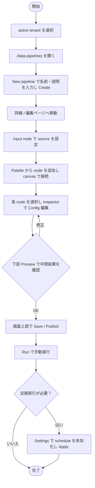
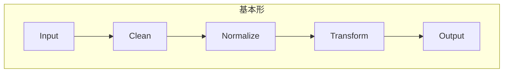
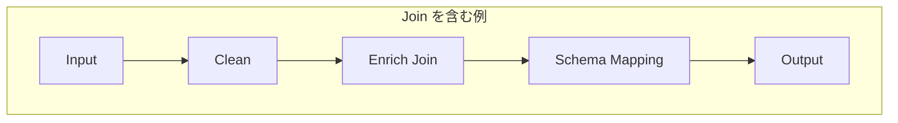
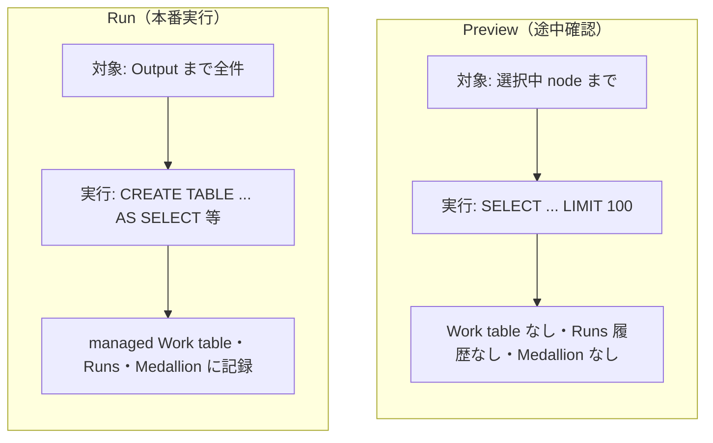
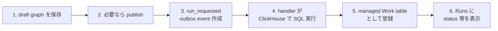
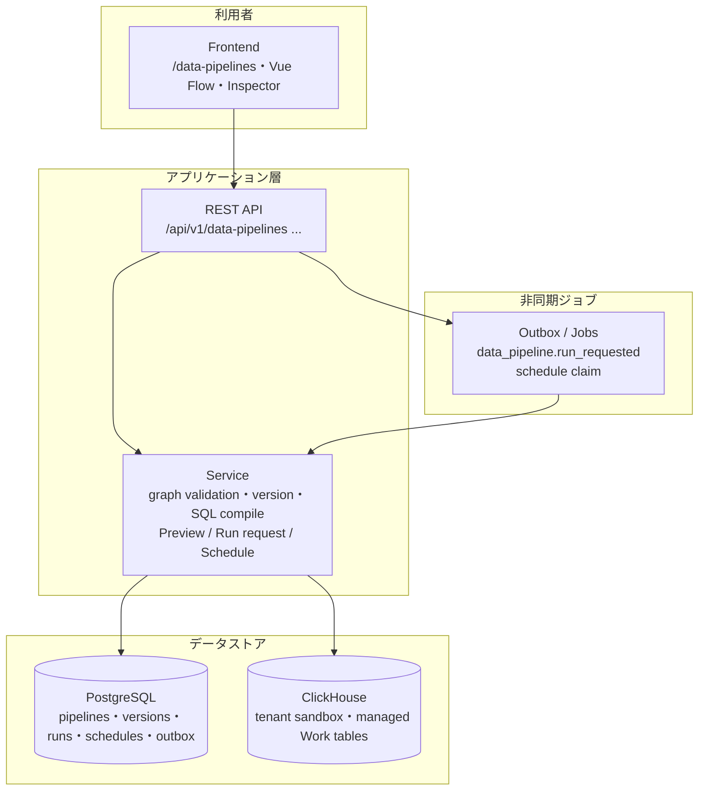
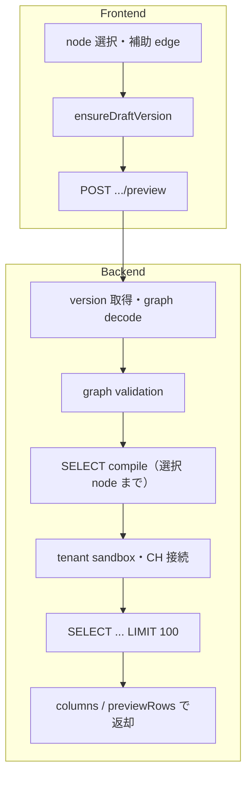
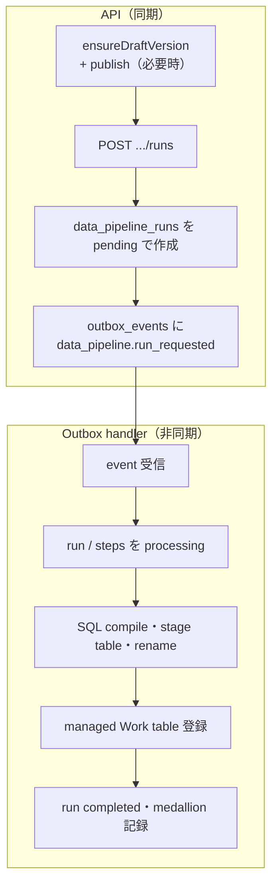

# データパイプライン利用マニュアル

この文書は、HaoHao の `/data-pipelines` 画面でデータクレンジング / 前処理パイプラインを作成、Preview、実行、定期実行するための利用者向けマニュアルです。

## このマニュアルで分かること

- `/data-pipelines` で pipeline を作成し、DAG として編集する流れ。
- Palette、canvas、Inspector、Preview / Runs / Schedules panel の役割。
- 各 node の用途、主要 config、JSON 例。
- Preview、Draft Run Preview、Run、Schedule の違いと使い分け。
- よくあるエラーの原因と、利用者が最初に確認すべき場所。

このマニュアルは、画面を操作する業務ユーザーが迷わず pipeline を作れることを主目的にしています。後半の「内部処理と仕組み」は、tenant admin や運用担当が失敗時の切り分けを行うための補足です。

## DAG の概要

データパイプラインでは、処理の流れを DAG として表します。DAG は `Directed Acyclic Graph` の略で、日本語では「有向非巡回グラフ」と呼ばれます。

- `Directed`: edge には向きがあります。HaoHao では左から右へ、前段 node の出力が後段 node の入力になります。
- `Acyclic`: 処理は同じ場所へ戻れません。`Clean -> Normalize -> Clean` のように cycle を作る graph は保存、Preview、Run できません。
- `Graph`: 処理単位の node と、node 同士をつなぐ edge の集合です。

DAG として考えると、「どの source から始まり、どの順番で加工され、どの Output に到達するか」が明確になります。たとえば次の graph では、Dataset を読み込み、NULL 処理、表記統一、列名変換を行ってから Work table に出力します。

```text
Input -> Clean -> Normalize -> Schema Mapping -> Output
```

branch を作ると、同じ入力から複数の処理を並行して作れます。ただし v1 の通常 node は upstream edge を 1 つだけ受け取る前提です。2 つの流れを合流させる場合は `Join` node を使い、別 Dataset / Work table を右側に追加する場合は `Enrich Join` を使います。

```text
Input -> Clean -> Join -> Output
Input -> Profile -> Join
```

利用者が意識すべき基本ルールは、`Input` からすべての node に到達でき、最終的に `Output` へ到達することです。孤立した node、逆向きの edge、cycle がある graph は実行可能な pipeline として扱われません。

## 対象者

- active tenant 上の Dataset または managed Work table を入力にして、クレンジング済みの managed Work table を作りたいユーザー。
- データ加工の流れを DAG として可視化し、処理定義を version 管理したいユーザー。
- 手動実行または定期実行の結果を Runs / medallion catalog で追跡したいユーザー。

## 前提条件

- active tenant が選択されていること。
- tenant role `data_pipeline_user` が付与されていること。
- 入力として使う Dataset または managed Work table が存在すること。
- Preview / Run には ClickHouse の tenant sandbox が利用できること。

権限が不足している場合、画面には `Data pipeline role required` が表示されます。tenant admin に `data_pipeline_user` role の付与を依頼してください。

## 最短手順

まず動作確認だけしたい場合は、次の順に進めます。

1. `/data-pipelines` で `New pipeline` を作成します。
2. 詳細ページで `Input` node を選択し、Dataset または Work table を選びます。
3. `Output` node を選択し、`displayName` と必要なら `tableName` を設定します。
4. `Output` node を選択したまま `Preview` を押し、列とサンプル値を確認します。
5. `Run` を押して managed Work table を作成します。
6. 出力を定期更新したい場合だけ、`Settings` から schedule を有効化します。

この最小形は `Input -> Output` です。最小形で source と output が正しく動くことを確認してから、`Clean`、`Normalize`、`Transform` などを 1 つずつ追加してください。

## 用語集

| 用語 | 意味 |
| --- | --- |
| Pipeline | データ加工の定義全体。名前、説明、version、schedule、run 履歴を持つ |
| Graph / DAG | node と edge で表した処理順。cycle を持たない有向 graph |
| Node | `Input`、`Clean`、`Output` などの処理単位 |
| Edge | node 同士の接続。前の node の出力が次の node の入力になる |
| Inspector | 選択 node の label と config を編集する右側領域 |
| Preview | 選択 node までの結果を最大 100 行で確認する操作 |
| Draft Run Preview | OCR や外部処理を含む draft graph を、一時データを使って確認する Preview |
| Run | Output まで全件処理し、managed Work table を作成する本番実行 |
| Version | 保存された graph。`Save` で増え、`Publish` で Run / Schedule の基準になる |
| Managed Work table | Run の出力として登録される ClickHouse table と metadata |

## 画面構成

データパイプライン画面は、一覧ページと詳細 / 編集ページに分かれています。

### 一覧ページ

`/data-pipelines` は pipeline の作成と一覧確認を行うページです。

| 領域 | 用途 |
| --- | --- |
| 新規 pipeline 作成 | pipeline の名前と説明を入力して作成する |
| Pipeline 一覧 | 既存 pipeline の名前、説明、status、更新日時を確認し、詳細 / 編集ページへ移動する |

### 詳細 / 編集ページ

`/data-pipelines/{pipelinePublicId}` は pipeline の編集、Preview、Run、Schedule を行うページです。

| 領域 | 用途 |
| --- | --- |
| Palette dialog | `+` button から開く block library。Input / Output、Extraction、Transform、Quality、Schema のカテゴリから node を追加する |
| 中央 canvas | Vue Flow による DAG builder。node の追加、配置、接続、選択、ドラッグ配置を行う |
| Canvas controls | palette を開く、Auto arrange で node を自動整列する |
| 右 Inspector | 選択 node の label と config を編集する |
| 下部 Preview / Runs / Schedules panel | Preview 結果、Run 履歴、schedule 一覧をタブで確認する |
| 画面上部 action | 一覧へ戻る、Undo / Redo、Refresh、Save、Run、Settings、Publish を実行する |

### キーボードショートカット

| 操作 | ショートカット | 説明 |
| --- | --- | --- |
| Undo | `Ctrl+Z` / `Cmd+Z` | graph 編集を 1 つ戻す |
| Redo | `Ctrl+Shift+Z` / `Cmd+Shift+Z` | Undo した graph 編集をやり直す |
| Redo | `Ctrl+Y` | Windows / Linux 系の Redo 操作 |

入力欄、textarea、select、dialog 内では、ブラウザ標準の編集操作が優先されます。たとえば Inspector の JSON textarea で `Ctrl+Z` を押した場合は、graph ではなく textarea の入力内容が Undo されます。

## 基本ワークフロー

1. active tenant を選択します。
2. `/data-pipelines` を開きます。
3. 一覧ページの `New pipeline` で名前と説明を入力し、`Create` を押します。
4. 作成後、詳細 / 編集ページへ移動します。
5. 初期 graph には `Input -> Output` が作成されます。
6. `Input` node を選択し、右 Inspector で source を設定します。
7. canvas control の `+` から Palette dialog を開き、必要な処理 node を追加します。
8. canvas 上で node を接続し、処理順を作ります。
9. 各 node を選択して Inspector の `Config UI` または `Config JSON` を編集します。
10. 下部 `Preview` で選択 node までの結果を確認します。
11. 必要に応じて画面上部の `Save` / `Publish` を押します。
12. 画面上部の `Run` で手動実行します。
13. 定期実行したい場合は画面上部の `Settings` で schedule を有効化し、頻度と時刻を設定して `Apply` を押します。

### 図: 利用者の基本ワークフロー



## Pipeline の作成と選択

### 新規作成

一覧ページの `New pipeline` で次を入力します。

- `Name`: pipeline の表示名。
- `Description`: 任意の説明。

`Create` を押すと pipeline が作成され、詳細 / 編集ページへ移動します。詳細 / 編集ページでは初期 graph として `Input -> Output` が表示されます。

### 既存 pipeline の選択

一覧ページの `Pipelines` から対象 pipeline を選択します。選択すると詳細 / 編集ページへ移動し、その pipeline の最新 version graph、run 履歴、schedule が読み込まれます。

### 名前と説明の変更

中央上部の `Name` / `Description` を編集し、`Save` を押します。`Save` は pipeline metadata と現在の graph version を保存します。

## DAG Builder の使い方

### Node の追加

canvas 左下の `+` button から `Block Library` を開き、追加したい node を選びます。Palette はカテゴリ別に分かれ、検索欄で node 名や説明から絞り込めます。

現行の node catalog:

| カテゴリ | Node | 用途 |
| --- | --- | --- |
| Input / Output | `Input` | Dataset または managed Work table を読み込む |
| Input / Output | `Output` | Run の最終結果を managed Work table として書き出す |
| Extraction | `Extract Text` | Drive OCR でファイルから text row を作る |
| Extraction | `Classify Document` | キーワード / 正規表現で文書種別を分類する |
| Extraction | `Extract Fields` | OCR text から構造化 field を抽出する |
| Extraction | `Extract Table` | 区切り text やレイアウト風 text を行データへ変換する |
| Quality | `Confidence Gate` | OCR / 抽出の confidence に基づいて注釈または絞り込みを行う |
| Quality | `Deduplicate` | key 列で重複文書 / レコードを検出する |
| Quality | `Canonicalize` | 表記揺れを標準値へ揃える |
| Quality | `Redact PII` | 個人情報や secret-like value をマスクする |
| Quality | `Detect Language Encoding` | 言語、encoding、文字化けスコア、正規化 text を付与する |
| Quality | `Human Review` | レビューが必要な行に status / reason を付与する |
| Quality | `Sample Compare` | 変更前後の列を比較し、差分 JSON を出す |
| Quality | `Quality Report` | 欠損率や row count などの品質メトリクスを出す |
| Schema | `Schema Inference` | サンプル行から schema 候補を推定する |
| Schema | `Schema Mapping` | source column を target schema へ対応付ける |
| Schema | `Schema Completion` | 不足列を固定値や他列から補完する |
| Transform | `Profile` | データを変更せず、前段の状態確認に使う |
| Transform | `Clean` | NULL、重複、外れ値、不正値などを処理する |
| Transform | `Normalize` | 文字列、数値、日付、カテゴリ値の形式を揃える |
| Transform | `Validate` | 必須、範囲、regex、許可値などの rule を定義する |
| Transform | `Join` | 2 つの pipeline branch を key で結合する |
| Transform | `Enrich Join` | 別 Dataset / Work table を右側 source として結合する |
| Transform | `Entity Resolution` | 抽出値を inline 辞書へ名寄せする |
| Transform | `Unit Conversion` | 固定換算率で標準単位へ変換する |
| Transform | `Relationship Extraction` | text から source / target 関係を抽出する |
| Transform | `Transform` | select、drop、rename、filter、sort、aggregate を行う |

node を追加すると、選択中 node の近くに配置されます。配置が見づらい場合は canvas control の `Auto arrange` を押すと、DAG の向きに沿って自動整列します。

### Node の接続

canvas 上の node 右側 handle から、次の node 左側 handle へ接続します。

基本形:

```text
Input -> Clean -> Normalize -> Transform -> Output
```

Join を含む例:

```text
Input -> Clean -> Enrich Join -> Schema Mapping -> Output
```

2 つの branch を `Join` node に入れる場合は、左側として扱いたい流れと右側として扱いたい流れの両方を `Join` へ接続し、Inspector で key 列と右側から追加する列を設定します。別 Dataset / Work table を直接結合したい場合は、branch を増やすより `Enrich Join` を使う方が簡単です。

#### 図: DAG の例（基本形・Join あり）





### Canvas の便利な操作

| 操作 | 使い方 |
| --- | --- |
| node 選択 | canvas 上の node をクリックする。Inspector と Preview 対象が切り替わる |
| node 移動 | node をドラッグする。Undo ではドラッグ前の位置へ 1 回で戻る |
| Auto arrange | canvas control の整列 icon を押す。node の順序を右方向に揃える |
| Undo / Redo | 画面上部 button またはショートカットで graph 編集を戻す / やり直す |
| edge 追加 | source handle から target handle へドラッグする |

Undo / Redo の対象は現在開いている詳細ページ上の未保存 draft graph です。`Save`、`Refresh`、pipeline 再読み込み後は、その時点の graph が新しい基準になります。

### Graph の制約

保存、Preview、Run 時に graph validation が行われます。

- `Input` は必ず 1 つ。
- `Output` は 1 つ以上。
- cycle は不可。
- node は最大 50。
- edge は最大 80。
- Input から到達できない node は不可。
- Output へ到達しない executable node は不可。
- edge は存在する node 同士を接続する必要があります。

## Inspector の使い方

右 Inspector では、選択 node の設定を編集します。

### Label

node の表示名です。canvas 上の node label に反映されます。

### Config UI

node type ごとのフォームです。source select、operation select、column list、mapping、condition などを UI で編集できます。

### Config JSON

同じ設定を JSON として直接編集できます。

Config UI と Config JSON は同期します。

- UI で変更すると JSON が更新されます。
- valid な JSON を入力すると UI に反映されます。
- invalid JSON の場合は error が表示され、graph には反映されません。

## Node 別設定

### Input

入力 source を指定します。

| 項目 | 説明 |
| --- | --- |
| `sourceKind` | `dataset`、`work_table`、または OCR 系 graph の `drive_file` |
| `datasetPublicId` | Dataset を使う場合の public ID |
| `workTablePublicId` | managed Work table を使う場合の public ID |
| `filePublicIds` | Drive file を使う場合の file public ID list |

UI では `Source kind` と `Dataset` / `Work table` select で選択できます。`drive_file` を選ぶ場合は、Drive file public ID を 1 行ずつ入力します。`drive_file` は `Extract Text` などの OCR / unstructured 処理を含む graph で使います。

JSON 例:

```json
{
  "sourceKind": "dataset",
  "datasetPublicId": "00000000-0000-0000-0000-000000000000"
}
```

### Profile

データを変更しない確認用 node です。v1 では passthrough として扱われます。

`Profile` は「この時点でどのような列があり、どの程度データが入っているか」を確認する目的で置きます。現行 runtime では出力行を変更しないため、後続 node の前に挟んでもデータ内容は変わりません。

### Extract Text

Drive file を対象に OCR を実行し、文書を text row として扱えるようにします。請求書、注文書、契約書、画像 PDF などの非構造データを pipeline に取り込む入口として使います。

主な config:

| 項目 | 説明 |
| --- | --- |
| `chunkMode` | `page` または `full_text`。ページ単位で扱うか全文を 1 単位で扱うか |
| `includeBoxes` | bounding box / layout 情報を含めるか |

JSON 例:

```json
{
  "chunkMode": "page",
  "includeBoxes": true
}
```

OCR や外部処理を含む graph は、通常の軽量 Preview ではなく `Draft Run Preview` として一時データを materialize する場合があります。画面に Draft Run Preview の notice が表示されたら、通常 Preview より処理が重い前提で実行してください。

### Classify Document

OCR text や抽出済み text を使って文書種別を分類します。キーワードや正規表現で `invoice`、`purchase_order`、`contract` などの label を付けたい場合に使います。

主な config:

| 項目 | 説明 |
| --- | --- |
| `classes` | label、keywords、regexes、priority を持つ分類 rule |
| `outputColumn` | 分類 label の出力列 |
| `confidenceColumn` | 分類 confidence の出力列 |

JSON 例:

```json
{
  "classes": [
    {
      "label": "invoice",
      "keywords": ["invoice", "請求書"],
      "priority": 10
    }
  ],
  "outputColumn": "document_type",
  "confidenceColumn": "document_type_confidence"
}
```

### Extract Fields

OCR text から日付、金額、取引先名、請求書番号などの field を抽出し、列として出力します。rule based extraction を使うため、抽出したい field 名、型、pattern を明示します。

主な config:

| 項目 | 説明 |
| --- | --- |
| `provider` | 現行は主に `rules` |
| `outputMode` | columns と JSON の出力形式 |
| `fields` | 抽出 field の name、type、required、patterns |

JSON 例:

```json
{
  "provider": "rules",
  "outputMode": "columns_and_json",
  "fields": [
    {
      "name": "document_date",
      "type": "date",
      "required": false,
      "patterns": ["(\\\\d{4}[-/]\\\\d{1,2}[-/]\\\\d{1,2})"]
    }
  ]
}
```

### Extract Table

text 内の表形式データを行データに変換します。まずは CSV のような区切り文字形式や、OCR 結果から得られる繰り返し行を構造化する用途で使います。

JSON 例:

```json
{
  "source": "text_delimited",
  "delimiter": ",",
  "headerRow": false
}
```

### Deduplicate

指定した key 列で重複を検出します。`mode` によって、重複状態を注釈として残すか、代表行だけを残すかを選びます。

JSON 例:

```json
{
  "keyColumns": ["document_number", "vendor"],
  "mode": "annotate",
  "statusColumn": "duplicate_status",
  "groupColumn": "duplicate_group_id"
}
```

### Canonicalize

表記揺れを揃える node です。トリム、空白正規化、大小文字変換、値 mapping などを column 単位で設定します。

JSON 例:

```json
{
  "rules": [
    {
      "column": "vendor_name",
      "outputColumn": "vendor_name_canonical",
      "operations": ["trim", "normalize_spaces"],
      "mappings": {
        "ABC Co., Ltd.": "ABC"
      }
    }
  ]
}
```

### Redact PII

メールアドレス、電話番号、郵便番号、API key らしい文字列などを mask します。Preview や人手レビューへ渡す前に、個人情報や secret-like value を隠したい場合に使います。

JSON 例:

```json
{
  "columns": ["text"],
  "types": ["email", "phone", "postal_code", "api_key_like"],
  "mode": "mask",
  "outputSuffix": "_redacted"
}
```

### Detect Language Encoding

OCR text や抽出 text の言語、文字化けの疑い、正規化済み text を出力します。多言語文書や文字化けが混ざる source の前処理に使います。

JSON 例:

```json
{
  "textColumn": "text",
  "outputTextColumn": "normalized_text",
  "languageColumn": "language",
  "mojibakeScoreColumn": "mojibake_score"
}
```

### Clean

欠損、重複、外れ値、不正値を処理します。

主な operation:

| operation | 用途 |
| --- | --- |
| `drop_null_rows` | 指定列が NULL の行を除外 |
| `fill_null` | NULL を指定値で補完 |
| `null_if` | 条件に一致する値を NULL に変換 |
| `clamp` | 数値を min / max の範囲に丸める |
| `trim_control_chars` | 制御文字を除去 |
| `dedupe` | key による重複除去 |

JSON 例:

```json
{
  "rules": [
    {
      "operation": "drop_null_rows",
      "columns": ["customer_id", "email"]
    },
    {
      "operation": "dedupe",
      "keys": ["customer_id"],
      "orderBy": "updated_at"
    }
  ]
}
```

### Normalize

表記、型、スケールを揃えます。

主な operation:

| operation | 用途 |
| --- | --- |
| `trim` | 前後空白を除去 |
| `lowercase` | 小文字化 |
| `uppercase` | 大文字化 |
| `normalize_spaces` | 連続空白を 1 つに正規化 |
| `remove_symbols` | 記号を除去 |
| `cast_decimal` | Decimal へ変換 |
| `round` | 数値丸め |
| `scale` | 数値に係数を掛ける |
| `parse_date` | 日時文字列を datetime に変換 |
| `to_date` | 日付へ変換 |
| `map_values` | カテゴリ値を mapping |

JSON 例:

```json
{
  "rules": [
    {
      "operation": "lowercase",
      "column": "email"
    },
    {
      "operation": "map_values",
      "column": "gender",
      "values": {
        "M": "male",
        "F": "female"
      }
    }
  ]
}
```

### Validate

品質チェック用の node です。v1 の SQL compiler では output を変更しない passthrough として扱われます。将来の品質 rule / error sample 拡張に向けて config を保存できます。

UI では column、operator、value を設定できます。

JSON 例:

```json
{
  "rules": [
    {
      "column": "email",
      "operator": "regex",
      "value": "^[^@]+@[^@]+$"
    },
    {
      "column": "amount",
      "operator": ">=",
      "value": 0
    }
  ]
}
```

### Confidence Gate

OCR や field extraction の confidence が一定以上かを判定します。低 confidence 行を除外するより、まずは `annotate` mode で status 列を付けて確認する使い方を推奨します。

JSON 例:

```json
{
  "threshold": 0.8,
  "mode": "annotate",
  "statusColumn": "gate_status"
}
```

### Human Review

レビューが必要な行に status、queue、reason を付けます。永続的な review queue を作成する node ではなく、後続の Work table や BI / 運用画面でレビュー対象を分けるための注釈 node として扱います。

JSON 例:

```json
{
  "reasonColumns": ["gate_status"],
  "statusColumn": "review_status",
  "queueColumn": "review_queue",
  "mode": "annotate"
}
```

### Sample Compare

変更前後の列を比較し、差分確認用の JSON や count を出します。canonicalize 前後、redaction 前後、schema mapping 前後の確認に使います。

JSON 例:

```json
{
  "pairs": [
    {
      "field": "vendor",
      "beforeColumn": "vendor_name",
      "afterColumn": "vendor_name_canonical"
    }
  ]
}
```

### Quality Report

欠損率、行数、品質 summary を出す node です。最終 Output の直前に置くと、出力前の品質状態を確認しやすくなります。

JSON 例:

```json
{
  "columns": ["customer_id", "email", "amount"],
  "outputMode": "row_summary"
}
```

### Schema Inference

サンプル行から型候補や欠損状況を推定します。新しい source の列を理解したり、Schema Mapping を作る前の調査に使います。

JSON 例:

```json
{
  "columns": [],
  "sampleLimit": 1000
}
```

### Schema Mapping

入力列を target schema に対応付け、target column だけを出力します。

| 項目 | 説明 |
| --- | --- |
| `sourceColumn` | 元の列名 |
| `targetColumn` | 出力列名 |
| `cast` | `string`, `int64`, `float64`, `decimal`, `date`, `datetime` など |
| `defaultValue` | source がない場合の既定値 |
| `required` | true の場合、source/default がない mapping は保存 / 実行時 error |

JSON 例:

```json
{
  "mappings": [
    {
      "sourceColumn": "customer_id",
      "targetColumn": "id",
      "cast": "string",
      "required": true
    },
    {
      "sourceColumn": "amount",
      "targetColumn": "total_amount",
      "cast": "decimal"
    }
  ]
}
```

### Schema Completion

足りない列を固定値、他列コピー、coalesce、concat で補完します。

主な method:

- `literal`
- `copy_column`
- `coalesce`
- `concat`
- `case_when` は v1 では `defaultValue` を使う簡易扱いです。

JSON 例:

```json
{
  "rules": [
    {
      "targetColumn": "source_system",
      "method": "literal",
      "value": "haohao"
    },
    {
      "targetColumn": "display_name",
      "method": "concat",
      "sourceColumns": ["first_name", "last_name"]
    }
  ]
}
```

### Enrich Join

右側 source と left join し、追加列を取り込みます。

| 項目 | 説明 |
| --- | --- |
| `rightSourceKind` | `dataset` または `work_table` |
| `rightDatasetPublicId` | 右側 Dataset public ID |
| `rightWorkTablePublicId` | 右側 Work table public ID |
| `joinType` | v1 は `left` のみ |
| `leftKeys` | 左側 key 列 |
| `rightKeys` | 右側 key 列 |
| `selectColumns` | 右側から追加する列 |

JSON 例:

```json
{
  "rightSourceKind": "work_table",
  "rightWorkTablePublicId": "00000000-0000-0000-0000-000000000000",
  "joinType": "left",
  "leftKeys": ["customer_id"],
  "rightKeys": ["id"],
  "selectColumns": ["segment", "region"]
}
```

### Join

2 つの upstream branch を key で join します。canvas 上で左側 stream と右側 stream の両方を `Join` node へ接続し、Inspector で key と取り込む列を設定します。

`Join` は同じ pipeline 内で分岐した結果を戻す用途に向いています。別 Dataset / Work table を右側に指定するだけなら、`Enrich Join` の方が設定が少なくなります。

JSON 例:

```json
{
  "joinType": "left",
  "joinStrictness": "all",
  "leftKeys": ["customer_id"],
  "rightKeys": ["customer_id"],
  "selectColumns": ["segment", "risk_score"]
}
```

### Entity Resolution

抽出済みの文字列を inline 辞書へ照合し、標準 entity や候補を付与します。取引先名、部署名、商品名などの揺れを辞書ベースで寄せたい場合に使います。

JSON 例:

```json
{
  "column": "vendor",
  "outputPrefix": "vendor",
  "dictionary": [
    {
      "id": "abc",
      "label": "ABC",
      "aliases": ["ABC Co., Ltd.", "ABC株式会社"]
    }
  ]
}
```

### Unit Conversion

数値と単位の列をもとに、標準単位へ変換します。重量、長さ、通貨風の単位などを固定換算率で揃えたい場合に使います。

JSON 例:

```json
{
  "rules": [
    {
      "valueColumn": "weight",
      "unitColumn": "weight_unit",
      "outputUnit": "kg",
      "conversions": [
        { "from": "g", "factor": 0.001 },
        { "from": "kg", "factor": 1 }
      ]
    }
  ]
}
```

### Relationship Extraction

text から source / target を capture する関係情報を抽出します。契約文書や問い合わせ文から「A が B に依頼した」「製品 X は部品 Y を含む」のような単純関係を rule で取り出したい場合に使います。

JSON 例:

```json
{
  "textColumn": "text",
  "patterns": [
    {
      "relationType": "related_to",
      "pattern": "(.+) depends on (.+)"
    }
  ]
}
```

### Transform

列選択、列削除、rename、filter、sort、aggregate を行います。

#### select_columns

```json
{
  "operation": "select_columns",
  "columns": ["customer_id", "email", "segment"]
}
```

#### drop_columns

```json
{
  "operation": "drop_columns",
  "columns": ["raw_payload"]
}
```

#### rename_columns

```json
{
  "operation": "rename_columns",
  "renames": {
    "customer_id": "id",
    "email_address": "email"
  }
}
```

#### filter

```json
{
  "operation": "filter",
  "conditions": [
    {
      "column": "amount",
      "operator": ">",
      "value": 0
    }
  ]
}
```

#### sort

```json
{
  "operation": "sort",
  "sorts": [
    {
      "column": "updated_at",
      "direction": "DESC"
    }
  ]
}
```

#### aggregate

```json
{
  "operation": "aggregate",
  "groupBy": ["segment"],
  "aggregations": [
    {
      "function": "sum",
      "column": "amount",
      "alias": "total_amount"
    },
    {
      "function": "count",
      "alias": "row_count"
    }
  ]
}
```

### Output

最終結果を managed Work table として登録します。

| 項目 | 説明 |
| --- | --- |
| `displayName` | Work table の表示名 |
| `tableName` | 任意。指定しない場合は run public ID から自動生成 |
| `writeMode` | v1 は `replace` |
| `engine` | v1 は `MergeTree` |

JSON 例:

```json
{
  "displayName": "Customer cleansing output",
  "tableName": "customer_cleansed",
  "writeMode": "replace",
  "engine": "MergeTree"
}
```

`tableName` は ClickHouse identifier として安全な名前だけ利用できます。英字または `_` で始め、英数字と `_` を使ってください。

## 実務レシピ

### 基本クレンジング

顧客マスタ、取引明細、CSV import 後のテーブルなどを整える基本形です。

```text
Input -> Clean -> Normalize -> Schema Mapping -> Output
```

使い方:

1. `Input` で source を選びます。
2. `Clean` で必須列が NULL の行を落とし、重複を除去します。
3. `Normalize` でメールやコードの大小文字、空白、日付形式を揃えます。
4. `Schema Mapping` で公開したい列名へ変更します。
5. `Output` を Preview してから Run します。

### 帳票 / OCR 抽出

画像、PDF、スキャン文書から構造化データを作る流れです。

```text
Input -> Extract Text -> Detect Language Encoding -> Classify Document -> Extract Fields -> Confidence Gate -> Human Review -> Output
```

使い方:

1. `Input` で Drive file を含む Dataset / Work table を選びます。
2. `Extract Text` で OCR text を作ります。
3. `Detect Language Encoding` で文字化けや言語を確認します。
4. `Classify Document` で請求書、注文書、契約書などの label を付けます。
5. `Extract Fields` で日付、金額、取引先などを列化します。
6. `Confidence Gate` と `Human Review` で低 confidence 行をレビュー対象にします。

OCR 系 node は Draft Run Preview になることがあります。Preview notice を確認し、重い source では小さなサンプルから設定してください。

### 品質チェック

出力前に不正値や欠損を見つける流れです。

```text
Input -> Clean -> Validate -> Quality Report -> Output
```

使い方:

1. `Validate` で必須、範囲、regex、許可値を設定します。
2. `Quality Report` で欠損率や row summary を確認します。
3. 問題が多い場合は `Clean` や `Normalize` に戻って rule を追加します。

### JOIN / 集計

明細にマスタ情報を付与し、集計テーブルを作る流れです。

```text
Input -> Enrich Join -> Transform -> Output
```

使い方:

1. `Input` で明細 table を選びます。
2. `Enrich Join` で顧客マスタ、商品マスタ、部署マスタなどを右側 source として選びます。
3. `Transform` の `aggregate` で group by と集計関数を設定します。
4. `Output` で集計済み Work table 名を設定します。

### 安全な出力作成

Run は output Work table を作成または置き換えるため、次の順で確認してください。

1. `Input` を Preview して source が正しいことを確認します。
2. 主要な変換 node ごとに Preview します。
3. 最後に `Output` node を選択して Preview します。
4. `Output.tableName` が安全な identifier であることを確認します。
5. `Run` を押します。

## Save と Publish

### Save

画面上部の `Save` は現在の graph を新しい version として保存します。

保存時に graph validation が行われます。validation error がある場合は画面に error が表示されます。

### Publish

画面上部の `Publish` は最新 version を published version にします。

published version は次の用途で使われます。

- 手動 Run の対象 version。
- Schedule の対象 version。
- Run / schedule 履歴の追跡。

現在の UI では、`Preview` は必要に応じて draft を自動保存します。`Run` は必要に応じて draft を自動保存し、published でなければ publish してから実行要求を作成します。明示的に version を固定したい場合は、先に `Save` と `Publish` を実行してください。

## Preview、Draft Run Preview、Run の違い

Preview は途中確認、Run は本番実行です。OCR や一部の抽出系 node を含む場合は、通常の read-only Preview ではなく Draft Run Preview として一時データを materialize して確認します。

| 項目 | Preview | Draft Run Preview | Run |
| --- | --- | --- | --- |
| 対象 | 選択中の node まで | 選択中の node まで | Output node まで |
| 実行内容 | `SELECT ... LIMIT 100` | 一時データを materialize して最大 100 行を返す | 最終結果を ClickHouse table として作成 |
| 主な対象 | SQL compile だけで確認できる graph | OCR / 外部処理 / draft run が必要な graph | 本番出力 |
| 出力 Work table | 作らない | 作らない | 作る / 置き換える |
| Run 履歴 | 残らない | 残らない | `Runs` に残る |
| Medallion 記録 | 残らない | 残らない | 残る |
| 用途 | 設定や列変換が正しいか軽く確認 | OCR / 抽出結果を一時的に確認 | 加工済みデータを正式に生成 |

Preview は「この node までの結果が想定通りか」を見るための読み取り専用確認です。Run は pipeline 全体を実行して、Output node の設定に従って managed Work table を作成します。

### 自動プレビューと手動プレビュー

一部の node は config 変更後に自動 preview されます。ただし LLM、API、OCR、外部処理など重い可能性がある node は、意図せず処理を走らせないよう手動 preview になります。node に `Manual preview` の表示がある場合は、設定が固まってから `Preview` / `Draft Run Preview` を押してください。

Preview 結果は選択 node と graph 内容に紐付きます。graph を変更すると、古い Preview は無効になり、再実行が必要になります。

### 図: Preview と Run の分岐



### 大規模データの場合

1 億行のような大規模データでは、Preview と Run の処理範囲を分けて考えてください。

Preview は表示結果を最大 100 行に制限します。ただし、必ず 100 行分だけ読んで終わるわけではありません。単純な `Input -> Clean -> Preview` のような graph では ClickHouse が `LIMIT 100` で早めに止められることがあります。一方で、`aggregate`、`sort`、`dedupe`、`join` などを含む場合は、正しい 100 行の結果を作るために、入力側の 1 億行を広く scan することがあります。

Run は基本的に Output node まで全件処理します。入力が 1 億行なら、pipeline 全体をそのデータに対して実行し、結果を managed Work table として作成します。ただし出力行数は処理内容によって変わります。`filter` で絞れば減り、`aggregate` すれば集計結果だけになり、`normalize` や `clean` 中心なら入力に近い行数になります。

| 操作 | 1 億行データでの扱い |
| --- | --- |
| Preview | 表示は最大 100 行。ただし処理内容によっては大きく scan する |
| Run | Output まで全件処理し、managed Work table を作る |

大規模データでは、まず Input や前段 node を Preview し、重い `join` / `aggregate` / `sort` は設定が固まってから Run してください。

## Preview

下部 `Preview` の `Preview` ボタンは、選択中の node までの処理結果を最大 100 行で確認します。

使い方:

1. canvas で確認したい node を選択します。
2. Inspector の config を編集します。
3. `Preview` を押します。
4. Preview table に結果が表示されます。

注意:

- Preview は選択 node までの SQL を read-only `SELECT ... LIMIT 100` として実行します。
- Preview 対象 node を選択していない場合は実行できません。
- config JSON が invalid な場合、graph に反映されず、Preview も期待通りの内容になりません。
- 入力 source が未設定の場合、backend で source 解決 error になります。
- OCR / extraction 系 node では Draft Run Preview notice が出る場合があります。その場合は一時データ作成や OCR cache 利用を伴うため、通常 Preview より時間がかかることがあります。

## 手動 Run

画面上部の `Run` ボタンで手動実行します。実行履歴は下部 `Runs` tab で確認します。

Run の流れ:

1. 現在の draft graph が保存されます。
2. 必要に応じて最新 version が publish されます。
3. `data_pipeline.run_requested` outbox event が作成されます。
4. outbox handler が ClickHouse で SQL を実行します。
5. 結果は tenant work database の managed Work table として登録されます。
6. Runs table に status、trigger、row count、created time、error が表示されます。

### 図: 手動 Run の流れ（利用者視点）



Run status:

| status | 説明 |
| --- | --- |
| `pending` | 実行要求作成済み |
| `processing` | outbox handler が処理中 |
| `completed` | 出力 Work table 登録完了 |
| `failed` | 実行失敗。Error 列を確認 |

`Refresh` を押すと Run 履歴を再取得します。active run がある場合は画面側でも定期的に自動更新します。

## Schedule

画面上部の `Settings` で定期実行を設定します。作成済み schedule は下部 `Schedules` tab で確認します。

設定項目:

| 項目 | 説明 |
| --- | --- |
| `Frequency` | `Daily`, `Weekly`, `Monthly` |
| `Timezone` | 例: `Asia/Tokyo` |
| `Run time` | `HH:MM` 形式。例: `03:00` |
| `Weekday` | weekly の場合に使用。1 から 7 |
| `Month day` | monthly の場合に使用。1 から 28 |

`Enabled` を on にして `Apply` を押すと、現在の published version に対して schedule が作成または更新されます。

注意:

- Schedule は作成時点の published version に紐付きます。現在の UI は必要に応じて draft を保存し、未 publish の場合は publish してから schedule を作成します。
- 別の version を publish した後も、既存 schedule の `versionId` は自動では差し替わりません。scheduler は pipeline の現在の published version と schedule の version が一致しない場合、その schedule を無効化します。pipeline を更新して publish した後は、必要に応じて schedule を作り直してください。
- schedule worker は due schedule を claim し、前回 run がまだ `pending` / `processing` の場合は新しい run を skip します。
- schedule を止めるには `Settings` で `Enabled` を off にして `Apply` するか、Schedules 一覧の disable 操作を使います。削除ではなく disabled になります。

## 出力 Work table

Run が成功すると、Output node の config に基づいて managed Work table が作成または置き換えられます。

- `displayName` が Work table の表示名になります。
- `tableName` が指定されていればその table 名を使います。
- `tableName` が未指定の場合は run public ID から `dp_...` 形式で自動生成されます。
- 出力は Dataset / Work table 画面、lineage、medallion catalog から追跡できます。

## 内部処理と仕組み

この章では、画面操作の裏側でどの API、DB table、service、ClickHouse query、job が動くかを説明します。

### 全体アーキテクチャ

データパイプラインは、主に次の層で構成されています。

| 層 | 主な責務 |
| --- | --- |
| Frontend | `/data-pipelines` 一覧、`/data-pipelines/{pipelinePublicId}` 詳細 / 編集、Vue Flow canvas、Inspector、Preview / Runs / Schedules panel |
| API | `/api/v1/data-pipelines` 配下の CRUD、version save / publish、preview、run request、schedule 操作 |
| Service | graph validation、version 管理、ClickHouse SQL compile、Preview 実行、Run request、schedule claim、medallion 記録 |
| PostgreSQL | pipeline metadata、version graph、run、run step、schedule、outbox event を tenant-scoped table に保存 |
| ClickHouse | Preview SELECT、Run の stage table 作成、最終 managed Work table 作成 |
| Outbox / Jobs | `data_pipeline.run_requested` event の非同期処理、due schedule の claim と run 作成 |

重要な点は、ユーザーが任意 SQL を保存・実行するのではなく、Vue Flow graph の structured config から backend が allowlist ベースで ClickHouse SQL を生成することです。

#### 図: レイヤーとデータの流れ



### Tenant と権限

すべての操作は active tenant に紐付きます。

- API は session cookie から現在のユーザーを確認します。
- active tenant がない場合、操作は失敗します。
- active tenant で `data_pipeline_user` role が必要です。
- mutation API は CSRF token を要求します。
- create / run request は `Idempotency-Key` に対応しています。
- PostgreSQL query は `tenant_id` 条件を必須にして、他 tenant の pipeline / version / run / schedule を参照しません。
- ClickHouse 実行時も tenant sandbox / tenant work database を使います。

### 主要 table

Data Pipeline v1 で使う PostgreSQL table は次の通りです。

| table | 保存内容 |
| --- | --- |
| `data_pipelines` | pipeline の名前、説明、status、published version への参照 |
| `data_pipeline_versions` | 保存された graph JSON、version number、validation summary、publish 状態 |
| `data_pipeline_runs` | manual / scheduled run の状態、出力 work table、row count、error |
| `data_pipeline_run_steps` | run 内の node ごとの状態、row count、error sample、metadata |
| `data_pipeline_schedules` | schedule の頻度、timezone、次回実行時刻、last status |
| `outbox_events` | `data_pipeline.run_requested` event を非同期 worker に渡すための event |
| `medallion_pipeline_runs` | medallion catalog 上の pipeline run 履歴 |

`graph` は `data_pipeline_versions.graph` に JSONB として保存されます。中身は Vue Flow 互換の `nodes` / `edges` です。

```json
{
  "nodes": [
    {
      "id": "input_1",
      "type": "pipelineStep",
      "position": { "x": 60, "y": 120 },
      "data": {
        "label": "Input",
        "stepType": "input",
        "config": {
          "sourceKind": "dataset",
          "datasetPublicId": "..."
        }
      }
    }
  ],
  "edges": [
    { "id": "edge_input_output", "source": "input_1", "target": "output_1" }
  ]
}
```

### API の役割

主な API は次の通りです。

| 操作 | API | 内部で呼ばれる service |
| --- | --- | --- |
| 一覧 | `GET /api/v1/data-pipelines` | `DataPipelineService.List` |
| 作成 | `POST /api/v1/data-pipelines` | `DataPipelineService.Create` |
| 詳細 | `GET /api/v1/data-pipelines/{pipelinePublicId}` | `DataPipelineService.Get` |
| 名前 / 説明更新 | `PATCH /api/v1/data-pipelines/{pipelinePublicId}` | `DataPipelineService.Update` |
| graph 保存 | `POST /api/v1/data-pipelines/{pipelinePublicId}/versions` | `DataPipelineService.SaveDraftVersion` |
| publish | `POST /api/v1/data-pipeline-versions/{versionPublicId}/publish` | `DataPipelineService.PublishVersion` |
| preview | `POST /api/v1/data-pipeline-versions/{versionPublicId}/preview` | `DataPipelineService.Preview` |
| run request | `POST /api/v1/data-pipeline-versions/{versionPublicId}/runs` | `DataPipelineService.RequestRun` |
| run 一覧 | `GET /api/v1/data-pipelines/{pipelinePublicId}/runs` | `DataPipelineService.ListRuns` |
| schedule 作成 | `POST /api/v1/data-pipelines/{pipelinePublicId}/schedules` | `DataPipelineService.CreateSchedule` |
| schedule 更新 | `PATCH /api/v1/data-pipeline-schedules/{schedulePublicId}` | `DataPipelineService.UpdateSchedule` |
| schedule 無効化 | `DELETE /api/v1/data-pipeline-schedules/{schedulePublicId}` | `DataPipelineService.DisableSchedule` |

詳細 API は pipeline 本体だけでなく、最新 versions、published version、直近 runs、schedules をまとめて返します。詳細 / 編集ページはこのレスポンスを元に canvas、Runs、Schedules を復元します。

### Frontend の状態管理

Frontend は Pinia の data pipeline store で次の状態を持ちます。

| state | 用途 |
| --- | --- |
| `items` | 一覧ページの pipeline list |
| `selectedPublicId` | 詳細表示中の pipeline public ID |
| `detail` | 詳細 API の結果 |
| `draftGraph` | canvas / Inspector で編集中の graph |
| `selectedNodeId` | Preview / Inspector の対象 node |
| `preview` | Preview API の結果 |
| `runs` | Run 履歴 |
| `schedules` | Schedule 一覧 |

一覧ページでは `store.load(false)` で list だけを取得します。詳細 / 編集ページでは list 取得後に `store.loadDetail(pipelinePublicId)` を呼び、対象 pipeline の graph / run / schedule を読み込みます。

Preview、Run、Schedule 作成の前には、frontend が `ensureDraftVersion()` を呼びます。最新 version の graph と `draftGraph` が同じなら既存 version を使い、違う場合は新しい draft version を保存します。これにより、ユーザーが明示的に `Save` を押し忘れても Preview / Run / Schedule は現在の canvas 内容に基づいて動きます。

### Graph validation

`Save`、`Publish`、`Preview`、`Run` の入口で backend は graph validation を行います。

validation の主な目的は、DAG として実行可能な形か、そして backend compiler が安全に処理できる形かを確認することです。

チェック内容:

- node が存在すること。
- node 数が 50 以下であること。
- edge 数が 80 以下であること。
- node ID が空でないこと。
- node ID が重複しないこと。
- step type が v1 catalog に存在すること。
- `input` がちょうど 1 つ存在すること。
- `output` が 1 つ以上存在すること。
- edge の source / target が存在する node を指すこと。
- self-loop がないこと。
- graph が acyclic であること。
- すべての node が input から到達可能であること。
- すべての node がいずれかの output に到達可能であること。
- input 以外の node に upstream edge があること。

加えて、SQL compile 時には v1 runtime の制約として、通常の処理 node は upstream edge がちょうど 1 つである必要があります。複数 upstream の DAG merge は v1 では任意には扱いません。Join は `enrich_join` node の config で右側 source を指定する方式です。

### Version の保存と publish

`Save` は現在の graph を新しい draft version として保存します。

内部処理:

1. `data_pipelines` を `tenant_id + public_id` で取得します。
2. graph validation を実行します。
3. graph と validation summary を JSONB に encode します。
4. `data_pipeline_versions` に新しい row を insert します。
5. `version_number` は同じ pipeline の最大 version number + 1 で採番されます。
6. audit に `data_pipeline.version.save` を記録します。

`Publish` は version を pipeline の current published version にします。

内部処理:

1. version を `tenant_id + versionPublicId` で取得します。
2. graph を decode して再 validation します。
3. transaction を開始します。
4. 対象 version の status を `published` にし、`published_at` を設定します。
5. 同じ pipeline の他の published version を `archived` にします。
6. `data_pipelines.published_version_id` を対象 version に更新し、pipeline status を `published` にします。
7. transaction を commit します。
8. audit に `data_pipeline.version.publish` を記録します。

このため、manual run と schedule は「現在 publish されている version」を基準に実行されます。

### SQL compiler の考え方

Data Pipeline v1 は raw SQL node を持ちません。backend は graph と各 node の structured config を読み、ClickHouse SQL を生成します。

基本方針:

- node を topological order で並べます。
- 各 node を ClickHouse の CTE に変換します。
- CTE 名は node ID から `step_...` 形式で安全な名前に正規化します。
- column、target column、alias、table name などは allowlist / identifier check を通します。
- 文字列、数値、bool、NULL は backend の literal builder で SQL literal に変換します。
- user input をそのまま SQL 断片として実行しません。
- Dataset / Work table の source は backend が tenant 内の resource として解決します。

Preview の SQL は、選択 node までの CTE を作り、最後に `SELECT * FROM step_selected LIMIT 100` の形で実行されます。

Run の SQL は、Output node までの CTE を作り、ClickHouse の `CREATE TABLE ... AS SELECT ...` に使われます。

概念的には次のような SQL が生成されます。

```sql
WITH
`step_input_1` AS (
  SELECT *
  FROM `tenant_raw_db`.`source_table`
),
`step_clean_1` AS (
  SELECT
    ifNull(`name`, 'unknown') AS `name`,
    `email` AS `email`
  FROM `step_input_1`
  WHERE isNotNull(`email`)
),
`step_output_1` AS (
  SELECT *
  FROM `step_clean_1`
)
SELECT *
FROM `step_output_1`
LIMIT 100
```

実際の SQL は graph と config に応じて backend が生成します。

### Node ごとの compile

各 node は次のように SQL へ変換されます。

| node | compile 内容 |
| --- | --- |
| `input` | Dataset または managed Work table の ClickHouse table を `SELECT *` |
| `profile` | v1 では passthrough |
| `extract_text` | Drive OCR を使い、file / page / text / confidence などを一時 table に materialize |
| `classify_document` | keyword / regex rule から document type と confidence を付与 |
| `extract_fields` | pattern rule から field column、evidence JSON、confidence を付与 |
| `extract_table` | text row を構造化 row へ変換 |
| `confidence_gate` | confidence 列から status を注釈、または低 confidence 行を filter |
| `deduplicate` | key column から duplicate group / status を付与、または代表行を残す |
| `canonicalize` | string operation と mapping で標準化列を作成 |
| `redact_pii` | PII / secret-like pattern を mask した列を作成 |
| `detect_language_encoding` | language、mojibake score、normalized text などを付与 |
| `schema_inference` | sample から schema suggestion JSON を付与 |
| `entity_resolution` | inline dictionary と照合して entity 候補 JSON を付与 |
| `unit_conversion` | 固定換算率で標準単位列を作成 |
| `relationship_extraction` | regex capture から relationship JSON を付与 |
| `clean` | NULL 除外、NULL 補完、NULL 化、clamp、制御文字除去、dedupe を `SELECT` / `WHERE` / window function に変換 |
| `normalize` | trim、lower / upper、space 正規化、記号除去、decimal / date 変換、round、scale、値 mapping を expression に変換 |
| `validate` | v1 では passthrough。将来の品質検査 metadata 用の config を保存 |
| `schema_mapping` | mapping に従って target column だけを `SELECT expr AS target` |
| `schema_completion` | literal、copy_column、coalesce、concat などで新しい列を追加 |
| `join` | 2 つの upstream CTE を key 条件で join |
| `enrich_join` | 右側 Dataset / Work table を解決し、left join して指定列を追加 |
| `transform` | select / drop / rename / filter / sort / aggregate を SQL に変換 |
| `human_review` | review status / queue / reason を注釈列として付与 |
| `sample_compare` | before / after 列の差分 JSON と変更数を付与 |
| `quality_report` | 欠損率や summary metrics を JSON として付与 |
| `output` | v1 では passthrough。Run 時の出力 table 設定として使う |

column の存在確認は upstream columns を使って行われます。例えば Schema Mapping で `customer_id` を `id` に変えた後、後続 node で `customer_id` を参照すると `unknown column` になります。

### Identifier と安全性

SQL compiler は identifier と operation を制限します。

- table name、target column、alias は `^[A-Za-z_][A-Za-z0-9_]{0,127}$` に一致する必要があります。
- ClickHouse identifier は quote されます。
- cast は `string`, `int64`, `float64`, `decimal`, `date`, `datetime` などの allowlist のみです。
- condition operator は `required`, `=`, `!=`, `>`, `>=`, `<`, `<=`, `in`, `regex` などの allowlist のみです。
- aggregate function は `count`, `sum`, `avg`, `min`, `max` のみです。
- `enrich_join` の join type は v1 では `left` のみです。
- `in` operator は value array が必要です。
- unsupported operation / method / cast / operator は validation error または compile error になります。

この設計により、pipeline 定義は JSON として保存されますが、任意 SQL 実行にはなりません。

### Preview の内部処理

Preview は、選択中 node までの結果を確認するための軽量実行です。

Frontend の流れ:

1. 選択 node ID を決めます。未選択の場合は Output node、なければ先頭 node を候補にします。
2. 選択 node が孤立している場合、frontend は input から選択 node、選択 node から output への edge を補助的に追加します。
3. `ensureDraftVersion()` で現在の draft graph を version として保存します。
4. `POST /api/v1/data-pipeline-versions/{versionPublicId}/preview` を呼びます。

Backend の流れ:

1. version を `tenant_id + versionPublicId` で取得します。
2. graph JSON を decode します。
3. graph validation を実行します。
4. selected node までの ClickHouse SELECT を compile します。
5. tenant sandbox を準備します。
6. tenant 用 ClickHouse connection を開きます。
7. `SELECT ... LIMIT 100` を実行します。
8. ClickHouse rows を `columns` と `previewRows` に変換して返します。

#### 図: Preview の処理の流れ



Preview は run row や output Work table を作りません。エラーは API response として返り、画面上の error に表示されます。

### Manual Run の内部処理

Manual Run は、UI 上は `Run` ボタン 1 つですが、内部では request 作成と実行処理が分離されています。

Frontend の流れ:

1. `ensureDraftVersion()` で現在の graph を保存します。
2. その version が published でない場合、frontend は publish API を呼びます。
3. `POST /api/v1/data-pipeline-versions/{versionPublicId}/runs` を呼びます。

Backend の request 作成:

1. version を取得します。
2. version status が `published` であることを確認します。
3. pipeline の `published_version_id` がその version を指していることを確認します。
4. graph validation を実行します。
5. `data_pipeline_runs` に `pending` run を作成します。
6. `outbox_events` に `data_pipeline.run_requested` event を作成します。
7. run に `outbox_event_id` を保存します。
8. audit に `data_pipeline.run.request` を記録します。

この時点で API response は返ります。実際の ClickHouse 実行は outbox worker が非同期で行います。

#### 図: Manual Run（同期リクエストと非同期実行）



Outbox handler の実行処理:

1. `data_pipeline.run_requested` event を受け取ります。
2. run を `processing` に更新します。
3. graph の全 node に対して `data_pipeline_run_steps` を作成し、step を `processing` にします。
4. graph を Output node まで compile します。v1 Run は Output node がちょうど 1 つ必要です。
5. tenant sandbox と tenant ClickHouse connection を準備します。
6. tenant work database に stage table を作ります。
7. stage table を target table に rename します。
8. target table を managed Work table として登録します。
9. 全 run step を `completed` にし、row count を保存します。
10. run を `completed` にし、`output_work_table_id` と row count を保存します。
11. medallion pipeline run を `completed` として記録します。
12. audit に `data_pipeline.run.complete` を記録します。

失敗した場合:

1. 全 run step を `failed` にします。
2. `error_sample` に `[{ "error": "..." }]` 形式で error を保存します。
3. run を `failed` にし、`error_summary` を保存します。
4. medallion pipeline run を `failed` として記録します。
5. outbox worker 側の retry / dead handling に従って event が扱われます。

現在の v1 実装では、成功時の step row count は各 node 個別の中間件数ではなく、最終 output Work table の row count が入ります。中間 step ごとの正確な row count / profile metadata は後続拡張対象です。

### Run 時の ClickHouse table 作成

Run では直接 target table を作らず、stage table を経由します。

処理の流れ:

1. target database は tenant work database です。
2. target table は Output node の `tableName` を使います。
3. `tableName` が空、または安全な identifier でない場合は run public ID から `dp_...` を自動生成します。
4. stage table 名は `__dp_stage_` + run public ID から作ります。
5. 既存 stage table を drop します。
6. `CREATE TABLE target_db.stage ENGINE = MergeTree ORDER BY tuple() AS {compiled SELECT}` を実行します。
7. 既存 target table を drop します。
8. stage table を target table に rename します。
9. `registerDatasetWorkTableForRef` で managed Work table として登録します。

つまり、Run 成功後に Dataset / Work table 側から見える出力は、ClickHouse table と PostgreSQL 上の managed Work table metadata の両方が揃った状態です。

### Schedule の内部処理

Schedule は `data_pipeline_schedules` に保存され、`DataPipelineScheduleJob` が定期的に due schedule を処理します。

Schedule 作成時:

1. pipeline を `tenant_id + public_id` で取得します。
2. pipeline に `published_version_id` があることを確認します。
3. frequency、timezone、run time、weekday / month day を正規化します。
4. `next_run_at` を計算します。
5. `data_pipeline_schedules` に insert します。
6. audit に `data_pipeline.schedule.create` を記録します。

Scheduler job:

1. 設定された interval で起動します。起動時に一度実行する設定もあります。
2. 同じ job が重複実行されないよう atomic flag で制御します。
3. transaction を開始します。
4. `enabled = true` かつ `next_run_at <= now` の schedule を claim します。
5. claim query は `FOR UPDATE SKIP LOCKED` を使うため、複数 worker がいても同じ schedule を同時処理しにくい設計です。
6. 次回 `next_run_at` を計算します。
7. pipeline の current published version と schedule の `version_id` が一致するか確認します。
8. 同じ schedule の active run がある場合は run を作らず `skipped` として次回時刻へ進めます。
9. 問題なければ `scheduled` trigger の run と outbox event を作成します。
10. schedule の `last_run_at`, `last_status`, `last_run_id`, `next_run_at` を更新します。
11. transaction を commit します。

実際の ClickHouse 実行は manual run と同じく outbox handler が処理します。

### Medallion catalog への記録

Run が完了または失敗すると、Data Pipeline は medallion pipeline run として記録されます。

記録内容:

| 項目 | 内容 |
| --- | --- |
| `pipeline_type` | `data_pipeline` |
| `runtime` | `clickhouse` |
| `trigger_kind` | `manual` または `scheduled` |
| `source_resource_kind` | 入力 source が Dataset なら `dataset`、Work table なら `work_table` |
| `source_resource_public_id` | Input node の source public ID |
| `target_resource_kind` | 成功時は `work_table` |
| `target_resource_public_id` | 出力 Work table の public ID |
| `status` | `completed` または `failed` |
| `metadata.versionPublicId` | 実行した version public ID |

この記録により、Dataset / Work table / medallion catalog から「どの pipeline run がどの source からどの output を作ったか」を追跡できます。

### 失敗時に見る場所

失敗時は次の順に確認します。

1. 詳細 / 編集ページの error message。
2. Runs tab の `Error`。
3. `data_pipeline_runs.error_summary`。
4. `data_pipeline_run_steps.error_summary` と `error_sample`。
5. outbox worker log。
6. medallion pipeline run の status / error summary。

Preview 失敗は run を作らないため、`data_pipeline_runs` には残りません。Run 失敗は run / run step / medallion に記録されます。

## よくあるエラーと対処

### `Data pipeline role required`

`data_pipeline_user` role がありません。tenant admin に role 付与を依頼してください。

### active tenant が選択されていない

tenant selector で active tenant を選択してください。active tenant がない状態では、pipeline 一覧、source Dataset / Work table、Preview、Run を正しく取得できません。

### `sourceKind must be dataset or work_table`

Input または Enrich Join の source kind が空、または不正です。通常の構造化 pipeline では Dataset / Work table を選択してください。Drive file を使う場合は、`Input -> Extract Text` を含む OCR 系 graph にし、`filePublicIds` を設定してください。

### Input source が見つからない

Dataset / Work table が削除された、別 tenant の resource を参照している、または権限が不足している可能性があります。Input node の `datasetPublicId` / `workTablePublicId` を選び直してください。

### `unknown column ...`

config に指定した列が upstream columns に存在しません。入力 source の列名、または前段 node の Schema Mapping / Transform による列名変更を確認してください。

### Config JSON が invalid

Inspector の `Config JSON` が JSON として壊れていると、graph に反映されません。カンマ、引用符、配列 / object の閉じ忘れを直してください。UI tab で編集できる項目は、まず `Config UI` から変更する方が安全です。

### cycle / 到達不能 node の error

edge の向きが逆、node が孤立している、または Output へつながっていない node がある可能性があります。すべての処理 node が `Input` から辿れて、最終的に `Output` へ到達する形にしてください。

### `unsafe identifier ...`

出力 table 名、target column、alias などに ClickHouse identifier として安全でない文字が含まれています。英字、数字、`_` を使い、先頭は英字または `_` にしてください。

### Output table 名が重複する

同じ pipeline 内の複数 Output node、または既存 table と同じ `tableName` を使っている可能性があります。`tableName` は用途が分かる一意な名前にしてください。未指定の場合は run public ID から自動生成されます。

### `run requires exactly one output node in v1`

v1 の Run は Output node 1 つだけを対象にします。Preview は複数 Output graph でも選択 node まで確認できますが、Run する graph は Output を 1 つにしてください。

### `data pipeline version is not published`

Schedule 作成や Run 対象 version が published ではありません。`Publish` を押すか、`Run` を押して自動 publish を行ってください。

### Preview / Run が古い設定で動く

Config JSON が invalid だと draft graph に反映されません。Inspector の error を解消してから Preview / Run してください。

### Preview が重い / 終わらない

`LIMIT 100` が付いていても、`aggregate`、`sort`、`dedupe`、`join`、OCR / extraction 系 node では入力を広く scan または一時 materialize することがあります。まず前段 node を Preview し、重い node は source や条件を絞ってから確認してください。

### Schedule が止まる / disabled になる

既存 schedule の version と pipeline の current published version が一致しない場合、scheduler が schedule を disabled にします。pipeline を編集して publish した後は、`Settings` で schedule を更新してください。前回 run が `pending` / `processing` のまま残っている場合も、新しい scheduled run は skip されます。

## v1 の制約

- runtime は ClickHouse 優先です。
- 入力は active tenant の Dataset、managed Work table、または OCR 系 graph で使う Drive file です。
- 出力は tenant work database の managed Work table です。
- DuckDB / Parquet runtime は未対応です。
- 外部 S3 / 外部 DB input は未対応です。
- 任意 SQL node はありません。structured config から allowlist ベースで SQL を生成します。
- LLM enrichment は未対応です。
- multi-output fanout write は未対応です。
- backfill UI は未対応です。
- `Profile` / `Validate` は v1 では主に定義保存 / passthrough 用です。厳密な品質検査や profile metadata の拡張は後続フェーズです。

## 推奨パターン

### まず最小 graph で確認する

最初は次の graph で Input / Output が動くことを確認してください。

```text
Input -> Output
```

Input source を選び、Output display name を設定して Preview / Run します。

### 加工は少しずつ追加する

一度に多くの node を追加せず、1 node 追加するたびに Preview してください。

```text
Input -> Clean -> Preview
Input -> Clean -> Normalize -> Preview
Input -> Clean -> Normalize -> Output -> Run
```

### Schema Mapping は後段に置く

Schema Mapping は target column だけを出力するため、後続 node では元の列名が使えなくなります。列名変更後に filter / aggregate を行う場合は、変更後の列名を使ってください。

### Run 前に Output を確認する

Run では最終 Output node までの結果が Work table に書き込まれます。Run 前に Output node を選択して Preview し、列と値を確認してください。
